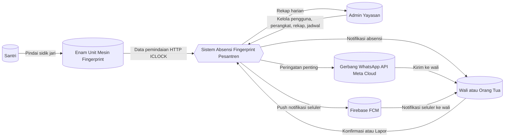
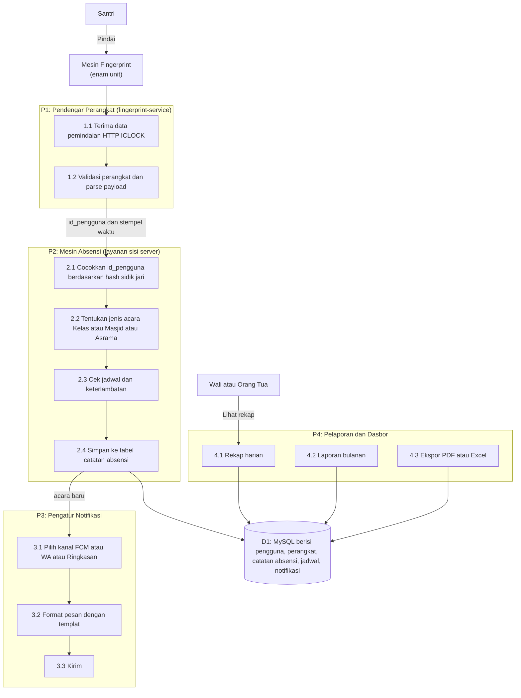
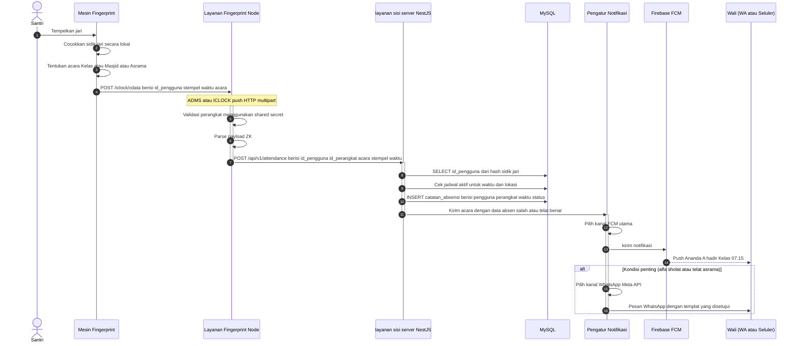
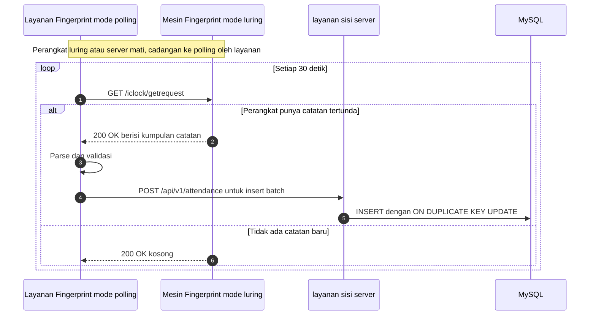
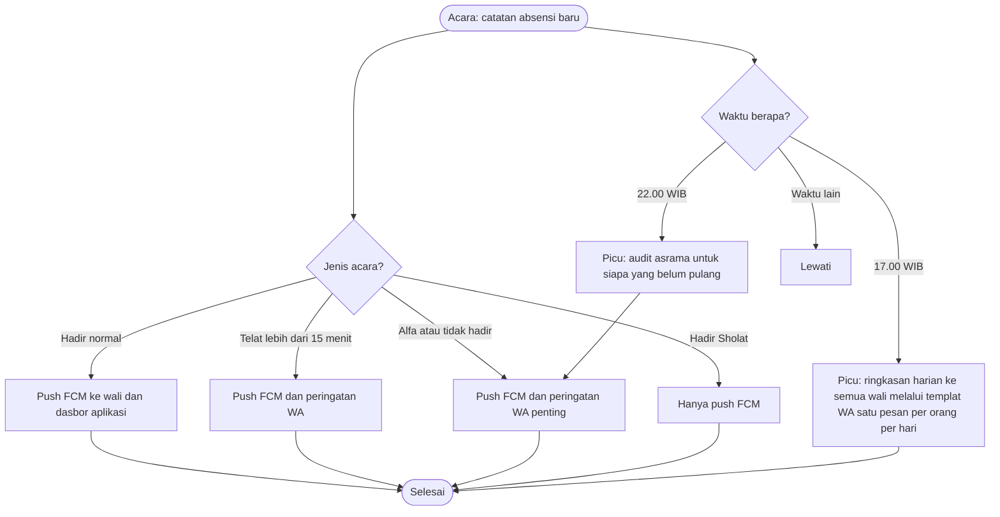
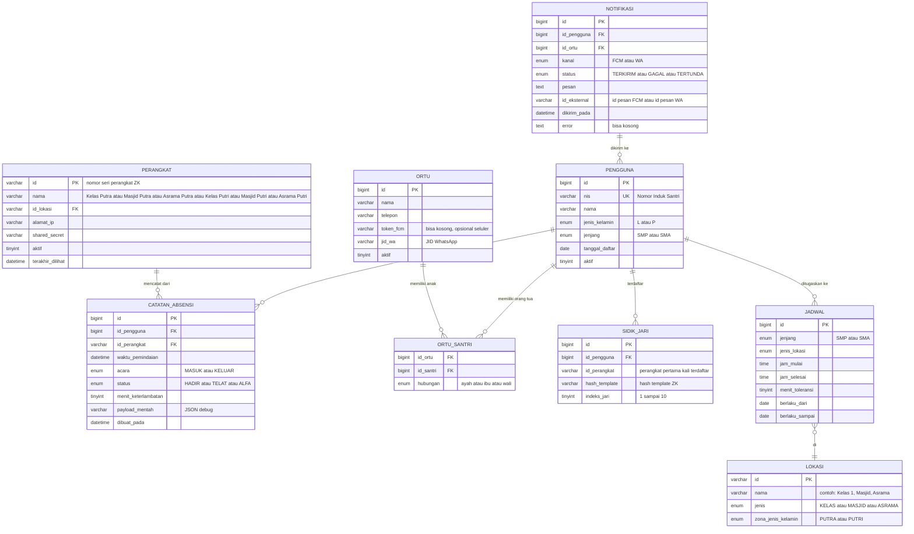

# Diagram Sistem: Absensi Fingerprint Pesantren

> Diagram siap pakai untuk kickoff pengembangan. Tiga diagram arsitektur perangkat keras sudah ada di `proposal_absensi_fingerprint_pesantren.md` (baris 16, 90, dan 167) — dokumen ini menambahkan lima diagram proses dan data.

## Ringkasan Tumpukan Teknologi (dari keputusan Council)

```
layanan-server/  → NestJS 10 + Prisma + MySQL 8.4 (InnoDB)
antar-muka/     → Next.js 14 + Tailwind + shadcn/ui
fingerprint/    → Node + node-zklib + pola adapter
notifikasi/ → Skema: Hibrida (FCM utama + WhatsApp kritis)
```

---

## 1. Diagram Alir Data (DAD) — Level 0 (Konteks)

**Pelaku:** Santri, Wali atau Orang Tua, Admin Yayasan, Enam Unit Mesin Fingerprint, Gerbang WhatsApp, Firebase FCM



---

## 2. DAD Level 1 (Dekomposisi)



---

## 3. Diagram Sekuensial — Pemindaian Absensi (Alur Normal)



---

## 4. Diagram Sekuensial — Mode Sinkronisasi atau Polling (Perangkat Luring)



---

## 5. Bagan Alir — Logika Pengaturan Notifikasi



---

## 6. Diagram Hubungan Entitas (ERD) — Tabel Inti



---

## Berkas Hasil

Diagram ini disimpan sebagai: `D:\Obsidian\AI-Agents\20-Projects\01-absensi-finger\02-SYSTEM-DIAGRAMS.md`

Bisa langsung di-pratinjau di Obsidian (mermaid live render).

## Langkah Lanjutan Setelah Diagram

1. Tentukan skema notifikasi (Hibrida: FCM utama dan WA penting), sudah dikonfirmasi pengguna.
2. Pilih merek perangkat fingerprint (cek merek yang sudah ada di sekolah).
3. Inisialisasi monorepo tiga layanan (Pisah Repo sesuai keputusan Council).
4. Buat skema Prisma berdasarkan ERD (bagian 6).
5. Hubungkan `fingerprint-service` ke layanan sisi server NestJS (diagram sekuensial bagian 3).
6. Implementasi pengatur notifikasi (bagan alir bagian 5).

## Lihat Juga

- `proposal_absensi_fingerprint_pesantren.md` — proposal asli (tiga diagram arsitektur)
- `02-COUNCIL-stack-decision.md` — alasan pemilihan tumpukan teknologi
- `60-Blueprints/HERMES_TUNING.md` — konfigurasi anti-halusinasi
