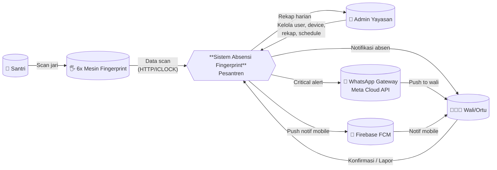
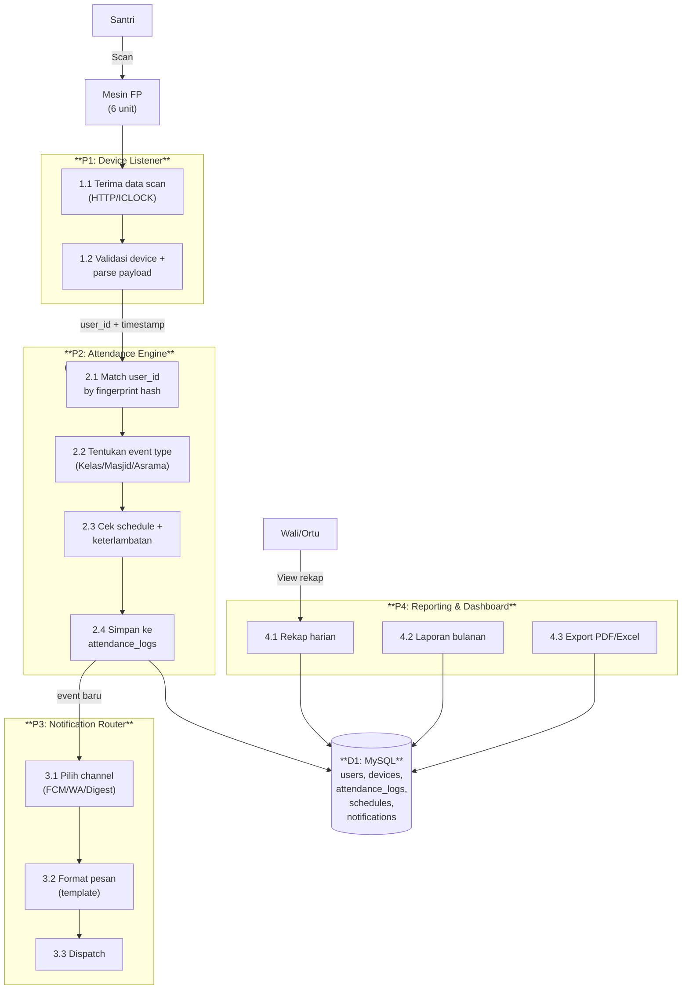
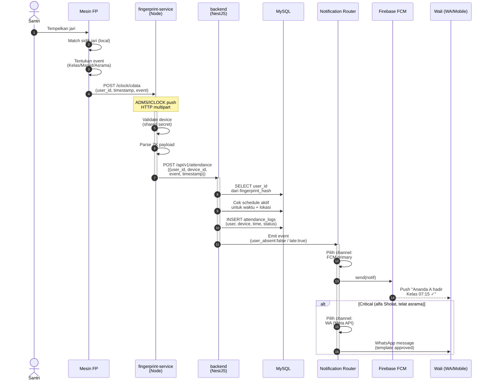
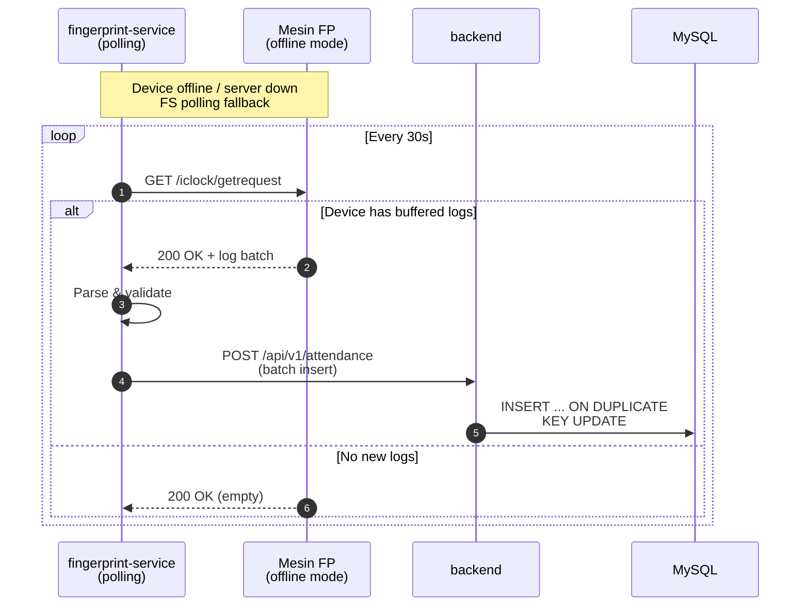
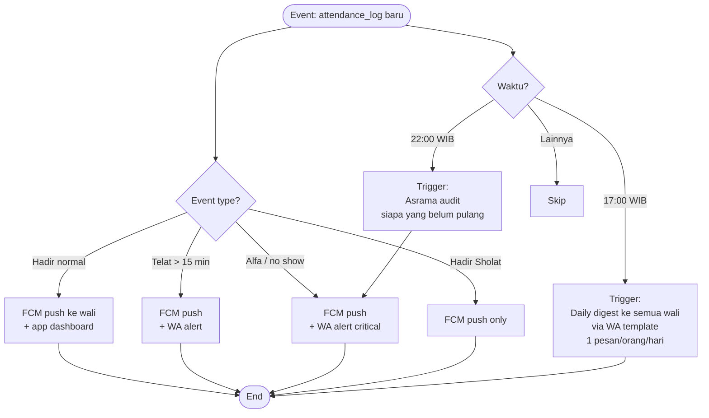
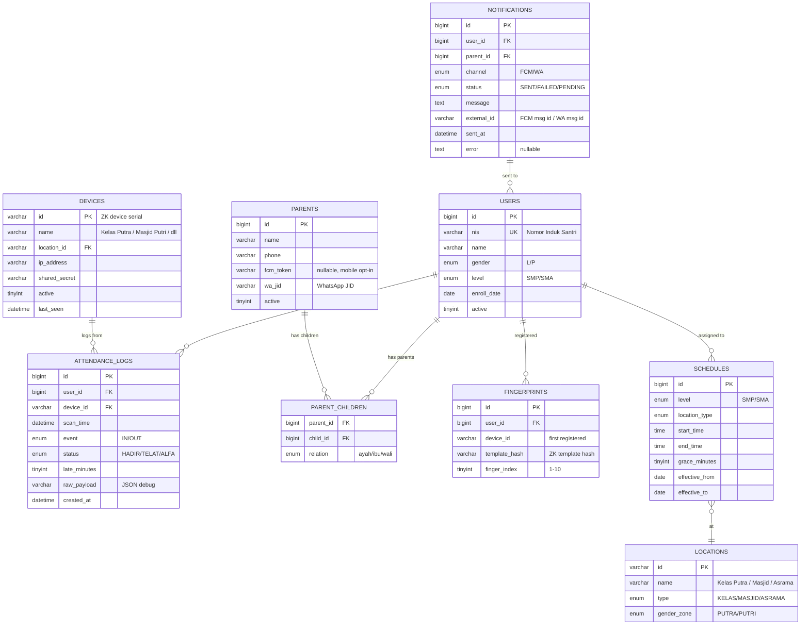

# System Diagrams: ABSENSI Fingerprint Pesantren

> **Engineering-ready diagrams** untuk kickoff development. 3 diagram arsitektur hardware sudah ada di `proposal_absensi_fingerprint_pesantren.md` (line 16/90/167) — yang ini **tambahan 5 diagram proses & data**.

## Stack Recap (dari Council decision)

```
backend/    → NestJS 10 + Prisma + MySQL 8.4 (InnoDB)
frontend/   → Next.js 14 + Tailwind + shadcn/ui
fingerprint/→ Node + node-zklib + adapter pattern
notification→ Skema: Hybrid (FCM primary + WhatsApp critical)
```

---

## 1. Data Flow Diagram (DFD) — Level 0 (Context)

**Actor:** Santri, Parent (Wali), Admin Yayasan, Mesin Fingerprint (6 unit), WhatsApp Gateway, Firebase FCM



---

## 2. DFD Level 1 (Decomposition)



---

## 3. Sequence Diagram — Scan Absensi (Happy Path)



---

## 4. Sequence Diagram — Sync/Polling Mode (Device Offline)



---

## 5. Flowchart — Notification Routing Logic



---

## 6. ERD (Entity Relationship Diagram) — Core Tables



---

## 📂 File Output

Diagram ini disimpan sebagai: `D:\Obsidian\AI-Agents\20-Projects\01-absensi-finger\02-SYSTEM-DIAGRAMS.md`

Bisa langsung di-preview di Obsidian (mermaid live render).

## 🔗 Next Steps Setelah Diagram

1. ✅ Tentukan **skema notifikasi** (Hybrid: FCM primary + WA critical) ← user confirm
2. Pilih **device fingerprint brand** (cek merk existing di sekolah)
3. Init monorepo 3 service (Pisah Repo sesuai Council)
4. Setup Prisma schema based on ERD (section 6)
5. Wire `fingerprint-service` ke NestJS backend (sequence diagram section 3)
6. Implement notification router (flowchart section 5)

## See Also

- `proposal_absensi_fingerprint_pesantren.md` — proposal asli (3 arsitektur diagram)
- `02-COUNCIL-stack-decision.md` — tech stack rationale
- `60-Blueprints/HERMES_TUNING.md` — anti-halusinasi config
