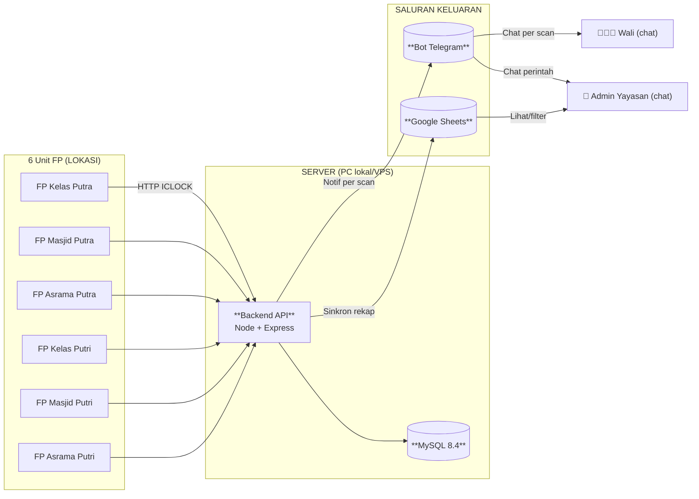
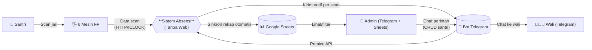
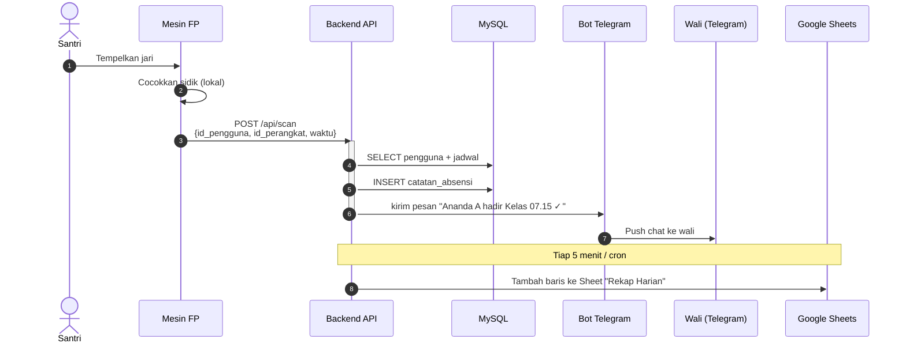

# 🎯 Solusi Absensi Tanpa Web Dashboard

> **Penyederhanaan:** 6 perangkat fingerprint → API server → basis data → wali (Telegram) + admin (Sheets/Bot).
> **Cocok untuk:** pesantren yang **belum siap** web dashboard, atau **belum butuh** admin UI.
> **Kompromi:** admin operasional via chat (kurang visual) + Sheets (filter manual), tapi **tanpa biaya pengembangan web**.

## 🤔 Kenapa "Tanpa Web" Tetap Butuh Kendali Admin

Pertanyaan kritis yang diangkat:

1. **Siapa kelola user/santri baru?** (registrasi, sidik jari, penghapusan)
2. **Siapa pantau rekap absen?** (harian, bulanan, per anak)
3. **Siapa atur jadwal?** (kelas SMP vs SMA, shift masjid, asrama)

Tanpa web → 3 saluran alternatif:

## 📡 Arsitektur Sederhana



## 📊 DAD Level 0 (Sederhana)



## 🔄 Sekuens — Scan Absensi (Sederhana)



## 🎮 Daftar Perintah Admin (via Bot Telegram)

| Perintah | Fungsi | Contoh |
|----------|--------|--------|
| `/daftar <nama> <nis> <kelas>` | Tambah santri | `/daftar Ahmad Fauzi 24001 SMP-1A` |
| `/hapussantri <nis>` | Nonaktifkan santri | `/hapussantri 24001` |
| `/perangkat daftar` | Lihat 6 perangkat & status | `/perangkat daftar` |
| `/perangkat atur <id> <nama>` | Ganti nama perangkat | `/perangkat atur FPK1 "Kelas Putra Lt 1"` |
| `/rekap [hari\|minggu\|bulan]` | Rekap absen | `/rekap hari` |
| `/cari <nama>` | Cek riwayat per anak | `/cari ahmad fauzi` |
| `/sinkron` | Kirim manual ke Sheets | `/sinkron` |
| `/siarkan <pesan>` | Pengumuman ke semua wali | `/siarkan Libur tanggal 17` |
| `/izin <nis> <alasan>` | Set status izin (override alfa) | `/izin 24001 Sakit` |

**Cara kerja:** Bot Telegram di VPS yang sama, mode `polling`. Setiap perintah → HTTP ke backend API. Respons → render Markdown → kirim balik.

## 📊 Google Sheets Sinkronisasi (Realtime Auto-Push)

**Konfigurasi:** service account GCP + Google Sheets API v4

**2 sheet utama:**

1. **Sheet "Rekap Harian"** (perbarui otomatis tiap scan):
   ```
   Waktu | NIS | Nama | Kelas | Lokasi | Status | Telat(m)
   07:15:23 | 24001 | Ahmad Fauzi | SMP-1A | Kelas Putra | HADIR | 0
   07:45:11 | 24002 | ... | TELAT | 30
   ```

2. **Sheet "Rekap Bulanan"** (cron tiap jam 17.00):
   ```
   NIS | Nama | Total Hadir | Total Telat | Total Alfa | Persentase
   24001 | Ahmad Fauzi | 28 | 2 | 0 | 93%
   ```

**Manfaat:** Admin tinggal buka Sheets di HP/laptop, filter per kelas, urutkan telat terbanyak. Ekspor PDF/Excel kalau perlu laporan ke yayasan.

## 🔄 Pembaruan Stack Council (Sederhana)

Karena tidak ada web frontend, **stack berubah dari 3 layanan → 2 layanan**:

```
backend/         → Node 20 + Express + Prisma + MySQL 8.4
                 → + Telegraf (kerangka bot Telegram)
                 → + googleapis (Sheets API)
fingerprint/     → Node 20 + node-zklib + TS (sama)
```

**Rekomendasi tetap sama:**
- Basis data: MySQL 8.4 (banyak tulis, InnoDB append-only)
- SDK FP: node-zklib + pola adapter
- Notifikasi: FCM/WhatsApp **diganti Telegram** (tanpa Meta/FCM, hemat biaya)

**Kompromi vs versi web:**
- ✅ Lebih cepat dibangun (1 minggu vs 1 bulan)
- ✅ Wali tinggal pakai Telegram (tanpa install aplikasi)
- ✅ Admin operasional via chat (tanpa pelatihan web)
- ❌ Tidak ada UI visual (grafik/dasbor/pemantauan waktu nyata)
- ❌ Sheets jadi bottleneck kalau trafik tinggi (batas 60 permintaan/menit per pengguna)

## 📅 Jadwal Otomatis (Bot Cron)

Tugas otomatis yang berjalan sendiri, tanpa admin:

| Cron | Tugas |
|------|-------|
| Tiap 5 menit | Dorong data baru ke Google Sheets |
| Tiap jam 17.00 | Kirim ringkasan harian ke semua wali via Telegram |
| Tiap jam 22.00 | Audit asrama (siapa yang belum pulang) |
| Tiap jam 06.00 | Hapus notifikasi lama (>30 hari) |
| Tiap jam 03.00 | Backup MySQL → `/var/backups/absensi/` |

## 🚀 Rencana Peluncuran (8 minggu)

1. **Minggu 1:** Init monorepo 2 layanan + basis data + skema Prisma (berdasarkan ERD)
2. **Minggu 2:** Uji integrasi `fingerprint-service` dengan 1 perangkat
3. **Minggu 3:** Endpoint API backend (scan, santri, perangkat CRUD)
4. **Minggu 4:** Bot Telegram (sisi wali: notif per scan)
5. **Minggu 5:** Bot Telegram (sisi admin: perintah CRUD)
6. **Minggu 6:** Sinkronisasi Google Sheets + cron
7. **Minggu 7:** Deploy ke server yayasan + atur HTTPS (Let's Encrypt)
8. **Minggu 8:** Pelatihan admin (1 jam) + peluncuran lunak 1 kelas

**Estimasi biaya:**
- VPS: Rp 100–200 ribu/bulan (DigitalOcean/IDCloudHost)
- Domain: Rp 200 ribu/tahun
- Google Sheets API: **GRATIS**
- Bot Telegram API: **GRATIS**
- Total: < Rp 300 ribu/bulan (vs WhatsApp Meta Rp 13,5 juta/bulan untuk 500 pengguna)

## 🔜 Kapan Tambah Web Dashboard

Pakai web **NANTI** kalau:
- Admin kewalahan via chat (sudah >5 perintah/hari)
- Butuh grafik visual untuk yayasan (grafik tren kehadiran)
- Ingin layanan mandiri untuk wali (cek riwayat sendiri, ubah pengaturan notif)

Saat itu, tambah `frontend/` (Next.js) yang memakai API yang sudah ada — **tanpa refactor backend**.

## Lihat Juga

- `02-SYSTEM-DIAGRAMS.md` — Diagram arsitektur lengkap (dengan web)
- `04-MULTI-CONCEPT-4-SCHEMAS.md` — 4 konsep perbandingan arsitektur
- `02-COUNCIL-stack-decision.md` — Alasan pemilihan stack
- `60-Blueprints/HERMES_TUNING.md` — Konfigurasi anti-halusinasi
