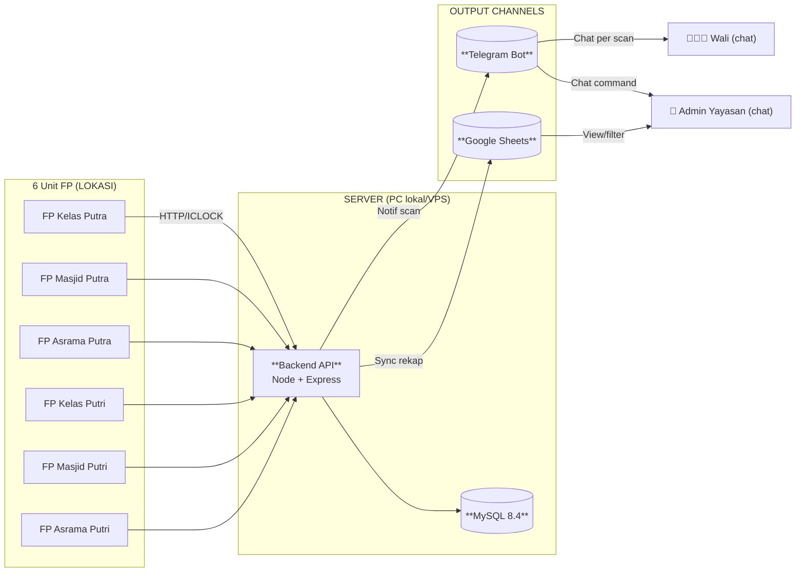
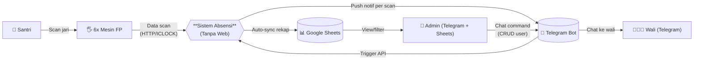
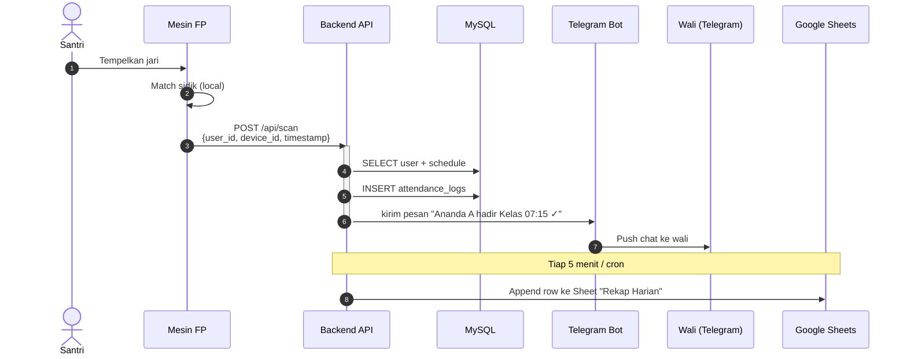

# 🎯 Solusi ABSENSI Tanpa Web Dashboard

> **Simplification**: 6 fingerprint device → BE API → DB → wali (Telegram) + admin (Sheets/Bot).
> **Cocok untuk:** pesantren yang **belum siap** web dashboard, atau **belum butuh** admin UI.
> **Trade-off:** Admin operasi via chat (kurang visual) + Sheets (manual filter), tapi **zero web dev cost**.

## 🤔 Kenapa "Tanpa Web" Tetap Butuh Admin Control

Pertanyaan kritis yang user angkat:
1. **Siapa kelola user/santri baru?** (registrasi, sidik jari, hapusan)
2. **Siapa monitor rekap absen?** (harian, bulanan, per anak)
3. **Siapa setup schedule?** (kelas SMP vs SMA, shift masjid, asrama)

Tanpa web → 3 channel alternatif:

## 📡 Arsitektur Sederhana



## 📊 DFD Level 0 (Simplified)



## 🔄 Sequence — Scan Absensi (Simplified)



## 🎮 Admin Command List (via Telegram Bot)

| Command | Fungsi | Contoh |
|---------|--------|--------|
| `/daftar <nama> <nis> <kelas>` | Tambah user/santri | `/daftar Ahmad Fauzi 24001 SMP-1A` |
| `/hapussantri <nis>` | Nonaktifkan user | `/hapussantri 24001` |
| `/device list` | Lihat 6 device & status | `/device list` |
| `/device set <id> <nama>` | Rename device | `/device set FPK1 "Kelas Putra Lt 1"` |
| `/rekap [hari|minggu|bulan]` | Rekap absen | `/rekap hari` |
| `/cari <nama>` | Cek history per anak | `/cari ahmad fauzi` |
| `/sync` | Manual push ke Sheets | `/sync` |
| `/broadcast <pesan>` | Kirim pengumuman ke semua wali | `/broadcast Libur tanggal 17` |
| `/izin <nis> <alasan>` | Set status izin (override alfa) | `/izin 24001 Sakit` |

**Cara kerja:** Bot Telegram di VPS yang sama, listen `polling` mode. Setiap command → HTTP ke backend API. Response → render Markdown → kirim balik.

## 📊 Google Sheets Sync (Realtime Auto-Push)

**Konfigurasi:** service account GCP + Google Sheets API v4

**2 sheets utama:**

1. **Sheet "Rekap Harian"** (auto-update tiap scan):
   ```
   Timestamp | NIS | Nama | Kelas | Lokasi | Status | Late(m)
   07:15:23  | 24001 | Ahmad Fauzi | SMP-1A | Kelas Putra | HADIR | 0
   07:45:11  | 24002 | ... | TELAT | 30
   ```

2. **Sheet "Rekap Bulanan"** (cron tiap jam 17:00):
   ```
   NIS | Nama | Total Hadir | Total Telat | Total Alfa | Persentase
   24001 | Ahmad Fauzi | 28 | 2 | 0 | 93%
   ```

**Benefit:** Admin tinggal buka Sheets di HP/laptop, filter per kelas, sort by telat terbanyak. Export PDF/Excel kalau perlu laporan ke yayasan.

## 🔄 Update Stack Council (Simplified)

Karena tidak ada web frontend, **stack berubah dari 3 service → 2 service**:

```
backend/         → Node 20 + Express + Prisma + MySQL 8.4
                 → + Telegraf (Telegram bot framework)
                 → + googleapis (Sheets API)
fingerprint/     → Node 20 + node-zklib + TS (sama)
```

**Rekomendasi tetap sama:**
- DB: MySQL 8.4 (write-heavy, InnoDB append-only)
- FP SDK: node-zklib + adapter pattern
- Notification: FCM/WhatsApp **diganti Telegram** (gak perlu Meta/FCM, hemat biaya)

**Trade-off vs versi web:**
- ✅ Lebih cepat di-build (1 minggu vs 1 bulan)
- ✅ Wali tinggal pakai Telegram (gak install app)
- ✅ Admin operasional via chat (gak perlu training web)
- ❌ Tidak ada UI visual (chart/dashboard/real-time monitoring)
- ❌ Sheets jadi bottleneck kalau traffic tinggi (rate limit 60 req/menit per user)

## 📅 Schedule Auto (Bot Cron)

Tugas otomatis yang jalan sendiri, gak perlu admin:

| Cron | Job |
|------|-----|
| Tiap 5 menit | Push data baru ke Google Sheets |
| Tiap jam 17:00 | Kirim daily digest ke semua wali via Telegram |
| Tiap jam 22:00 | Audit asrama (siapa yang belum pulang) |
| Tiap jam 06:00 | Hapus notification lama (>30 hari) |
| Tiap jam 03:00 | Backup MySQL → `/var/backups/absensi/` |

## 🚀 Rollout Plan (8 minggu)

1. **Minggu 1:** Init monorepo 2 service + DB + Prisma schema (based on ERD)
2. **Minggu 2:** `fingerprint-service` integration test dengan 1 device
3. **Minggu 3:** Backend API endpoints (scan, user, device CRUD)
4. **Minggu 4:** Telegram bot (wali side: notif per scan)
5. **Minggu 5:** Telegram bot (admin side: 9 commands di atas)
6. **Minggu 6:** Google Sheets sync + cron jobs
7. **Minggu 7:** Deploy ke server yayasan + setup HTTPS (Let's Encrypt)
8. **Minggu 8:** Training admin (1 jam) + soft launch 1 kelas

**Estimasi biaya:**
- Server VPS: Rp 100-200rb/bulan (DigitalOcean/IDCloudHost)
- Domain: Rp 200rb/tahun
- Google Sheets API: **GRATIS**
- Telegram Bot API: **GRATIS**
- Total: < Rp 300rb/bulan (vs Meta WhatsApp Rp 13.5jt/bulan untuk 500 user)

## 🔜 Kapan Tambah Web Dashboard

Pakai web **NANTI** kalau:
- Admin kewalahan handle via chat (sudah >5 perintah/hari)
- Butuh chart visual untuk yayasan (grafik tren kehadiran)
- Ingin self-service untuk wali (cek history sendiri, ubah notif setting)

Saat itu, tambah `frontend/` (Next.js) yang consume API existing — **zero refactor backend**.

## See Also

- `02-SYSTEM-DIAGRAMS.md` — Diagram original (dengan web)
- `02-COUNCIL-stack-decision.md` — Stack rationale
- `60-Blueprints/HERMES_TUNING.md` — Anti-hallusinasi config
