# Lima Konsep Sistem Absensi Fingerprint Pesantren

Dokumen ini membandingkan lima konsep arsitektur sistem absensi, dari yang paling sederhana (Konsep 1) sampai yang paling lengkap (Konsep 5: Mobile App). Yayasan atau pihak sekolah dapat memilih konsep yang paling sesuai dengan kebutuhan, bujet, dan kapasitas sumber daya manusia yang tersedia.

**Setiap konsep dilengkapi empat diagram lengkap:**
- **DAD L0** (Diagram Alir Data Level 0) — gambaran umum sistem dengan dunia luar
- **DAD L1** (Diagram Alir Data Level 1) — dekomposisi proses internal sistem
- **Diagram Sekuens** — urutan waktu saat pemindaian absensi
- **ERD** (Diagram Hubungan Entitas) — struktur basis data

---

## Penomoran Perangkat Fingerprint

Seluruh konsep di dokumen ini menggunakan skema penomoran perangkat yang sama.

| Kode | Lokasi          | Gender |
|------|-----------------|--------|
| FP1  | Unit 1          | Putra  |
| FP2  | Unit 2          | Putra  |
| FP3  | Unit 3          | Putra  |
| FP4  | Unit 4          | Putri  |
| FP5  | Unit 5          | Putri  |
| FP6  | Unit 6          | Putri  |

---

## Tabel Perbandingan Ringkas

| No | Nama Konsep              | Saluran ke Wali          | Saluran Admin                  | Biaya per Bulan       | Waktu Pengembangan | Kapasitas Pengguna      |
|----|--------------------------|--------------------------|--------------------------------|-----------------------|--------------------|-------------------------|
| 1  | Minimalis WhatsApp       | WhatsApp                 | Bot WhatsApp                   | di bawah Rp 50 ribu   | 2 minggu           | sampai 100 pengguna     |
| 2  | Minimalis Telegram       | Telegram                 | Bot Telegram + Google Sheets   | di bawah Rp 150 ribu  | 4 minggu           | sampai 300 pengguna     |
| 3  | Ringan Web + Telegram    | Telegram + Web Wali      | Web Admin + Google Sheets      | di bawah Rp 300 ribu  | 6 minggu           | 300–500 pengguna        |
| 4  | Standar Web + Multi-Saluran | Notifikasi Push + WhatsApp + Telegram | Web Admin + Sheets | di bawah Rp 500 ribu  | 8 minggu           | 500–1.000 pengguna      |
| 5  | Mobile App (APK)         | Notifikasi Push aplikasi | Aplikasi Mobile Admin + Wali   | di bawah Rp 600 ribu  | 10 minggu          | 500–2.000 pengguna      |

Detail masing-masing konsep, diagram, kelebihan, dan kekurangan tersedia di bagian bawah.

---

## Konsep 1: Minimalis WhatsApp Saja

**Biaya operasional:** di bawah Rp 50 ribu per bulan (VPS 2 GB + listrik).
**Waktu pengembangan:** 2 minggu.
**Kapasitas pengguna:** yayasan sangat hemat, 50–200 pengguna.
**Saluran utama:** WhatsApp ke wali, Bot WhatsApp untuk admin.

### DAD Level 0 — Konteks

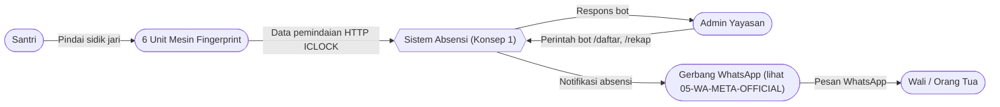

### DAD Level 1 — Dekomposisi Proses

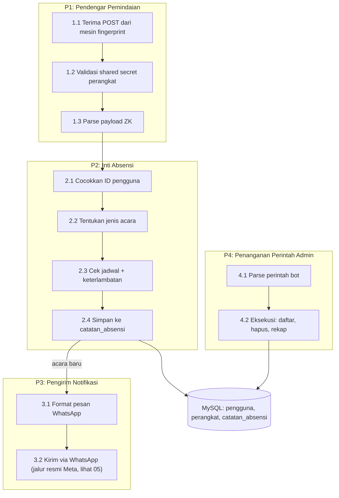

### Diagram Sekuens — Pemindaian Absensi

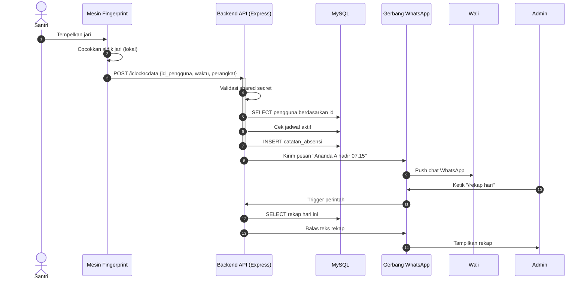

### ERD — Tabel Inti (Versi Sederhana)

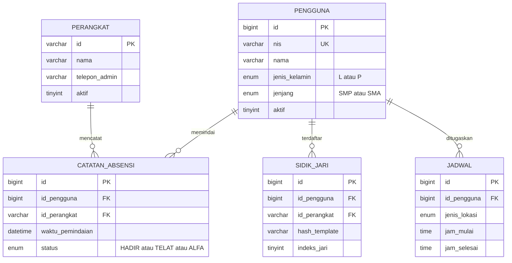

### Cara Kerja

1. Santri menempelkan jari pada salah satu dari enam unit fingerprint.
2. Perangkat fingerprint mencocokkan sidik jari secara lokal dan mengirim data ke server.
3. Server memvalidasi data, mencocokkan ID pengguna, mengecek jadwal, lalu menyimpan catatan absensi.
4. Server mengirim pesan WhatsApp ke nomor wali yang sudah terdaftar.
5. Wali menerima notifikasi di WhatsApp.
6. Admin mengelola data melalui bot WhatsApp dengan perintah seperti `/daftar Ahmad 24001`.
7. Rekapitulasi dilakukan dengan kueri langsung ke MySQL melalui CLI atau phpMyAdmin.

### Kelebihan

- Biaya sangat rendah.
- Waktu pengembangan singkat.
- Wali sudah memiliki aplikasi WhatsApp sehingga tidak perlu instalasi tambahan.

### Kekurangan

- Risiko pemblokiran nomor WhatsApp berkurang drastis karena menggunakan jalur resmi Meta (lihat `05-WA-META-OFFICIAL.md`).
- Admin harus mengoperasikan sistem melalui chat, bukan tampilan visual.
- Tidak memiliki dasbor visual untuk rekapitulasi.

---

## Konsep 2: Minimalis Telegram Tanpa Web

**Biaya operasional:** di bawah Rp 150 ribu per bulan.
**Waktu pengembangan:** 4 minggu.
**Kapasitas pengguna:** 200–400 pengguna.
**Saluran utama:** Telegram ke wali, Bot Telegram + Google Sheets untuk admin.

### DAD Level 0 — Konteks

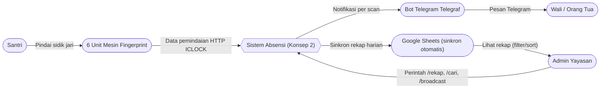

### DAD Level 1 — Dekomposisi Proses

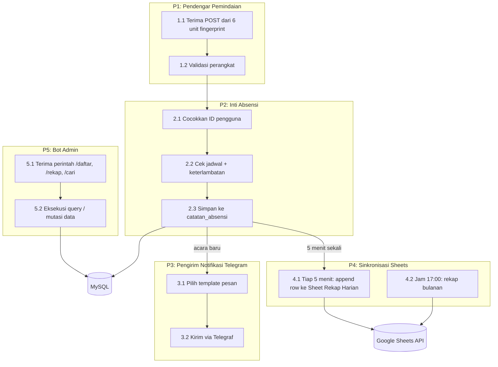

### Diagram Sekuens — Pemindaian + Sinkron

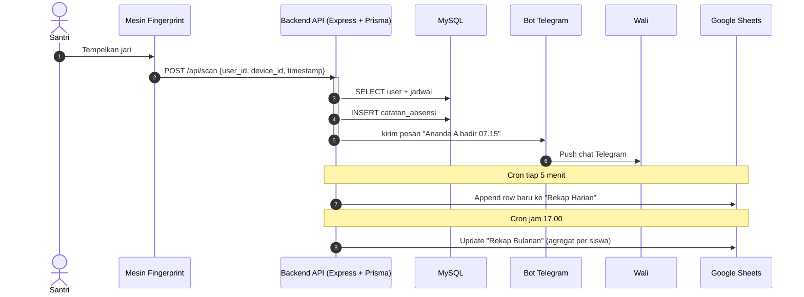

### ERD — Tabel Inti (Versi Standar)

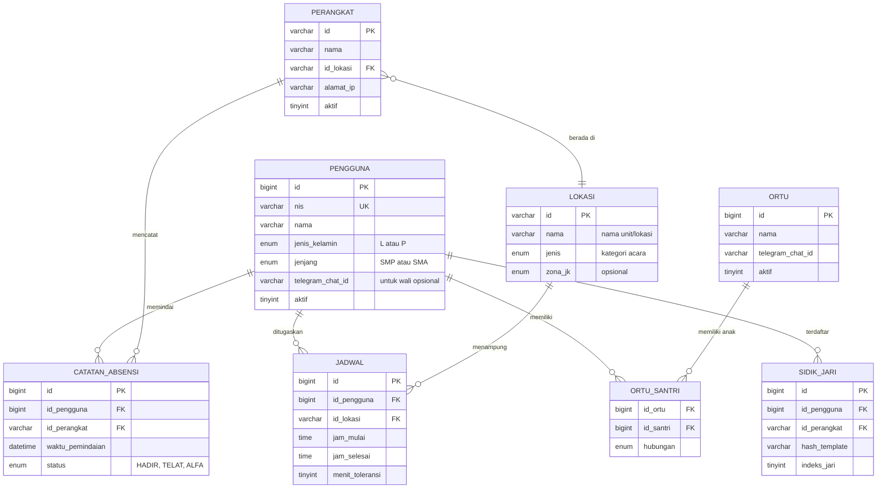

### Fitur Tambahan Dibandingkan Konsep 1

- Dibandingkan WhatsApp non-resmi, jalur Telegram lebih sederhana, tetapi WA jalur Meta (lihat `05-WA-META-OFFICIAL.md`) kini setara dari sisi stabilitas.
- Sinkronisasi otomatis ke Google Sheets untuk rekapitulasi.
- Penjadwalan dan perizinan melalui perintah bot.
- Sembilan perintah admin meliputi: daftar, hapus, rekap, cari, siarkan, dan lain-lain.

### Kelebihan

- Stabil karena menggunakan API resmi Telegram.
- Rekapitulasi otomatis melalui Google Sheets.
- API Telegram gratis tanpa biaya per pesan.

### Kekurangan

- Wali harus memasang aplikasi Telegram.
- Tidak memiliki dasbor web.

---

## Konsep 3: Ringan Web + Telegram

**Biaya operasional:** di bawah Rp 300 ribu per bulan.
**Waktu pengembangan:** 6 minggu.
**Kapasitas pengguna:** 300–500 pengguna.
**Saluran utama:** Telegram + Web Wali (self-service), Web Admin + Sheets untuk admin.

### DAD Level 0 — Konteks

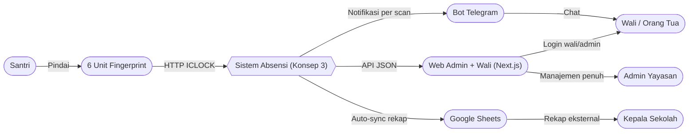

### DAD Level 1 — Dekomposisi Proses

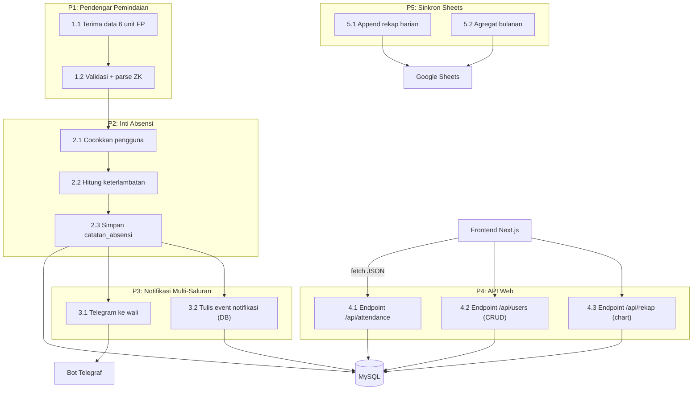

### Diagram Sekuens — Pemindaian + Akses Web

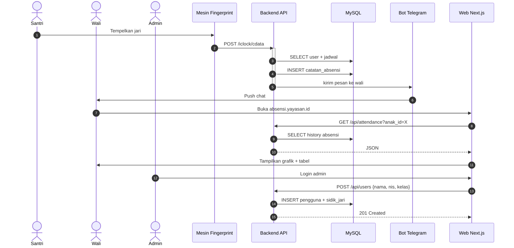

### ERD — Dengan Modul Web

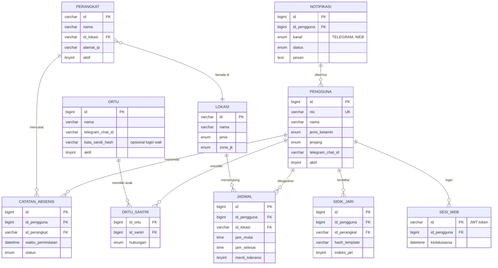

### Fitur Tambahan

- Dasbor admin berbasis web menggunakan Next.js dan Tailwind.
- Login wali dan admin dengan JWT.
- Manajemen pengguna, perangkat, dan jadwal melalui antarmuka web.
- Rekapitulasi visual dengan grafik per kelas dan filter berdasarkan tanggal.
- Wali bisa cek history sendiri lewat web (self-service).
- Ekspor laporan ke PDF dan Excel.
- Wali tetap menerima notifikasi melalui Telegram.
- Rekapitulasi tetap tersedia melalui Google Sheets.

### Kelebihan

- Dasbor visual mempermudah pengelolaan.
- Pemasangan perangkat baru lebih cepat.
- Wali tetap pada kanal Telegram.
- Wali bisa self-service (cek history tanpa harus tanya admin).

### Kekurangan

- Ada tambahan biaya pengembangan web sekitar satu minggu.
- Admin perlu pelatihan singkat untuk menggunakan dasbor.

---

## Konsep 4: Standar Web + Multi-Saluran Notifikasi

**Biaya operasional:** di bawah Rp 500 ribu per bulan (atau Rp 13,5 juta per bulan apabila menggunakan WhatsApp Meta per pemindaian).
**Waktu pengembangan:** 8 minggu.
**Kapasitas pengguna:** 500–1.000 pengguna untuk banyak kelas dan banyak cabang.
**Saluran utama:** Notifikasi Push (FCM) + WhatsApp Meta + Telegram (cadangan), Web Admin lengkap, Mobile opsional.

### DAD Level 0 — Konteks

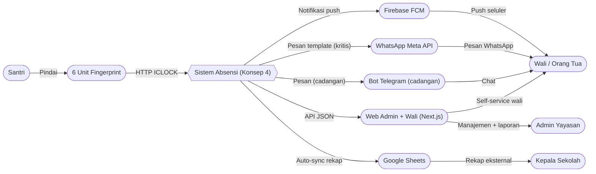

### DAD Level 1 — Dekomposisi Proses

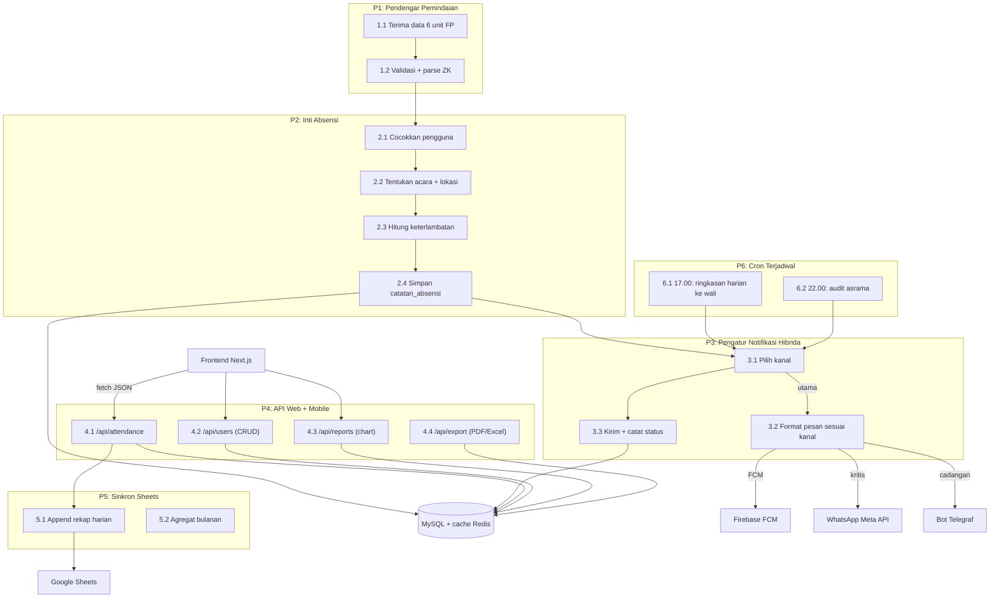

### Diagram Sekuens — Pemindaian + Notifikasi Hibrida

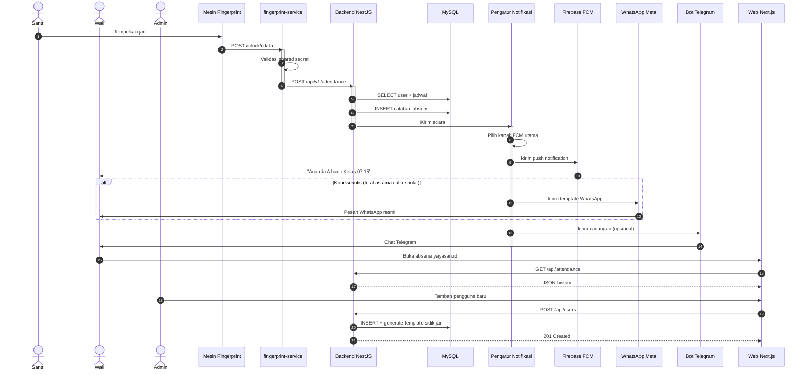

### ERD — Versi Lengkap dengan Notifikasi

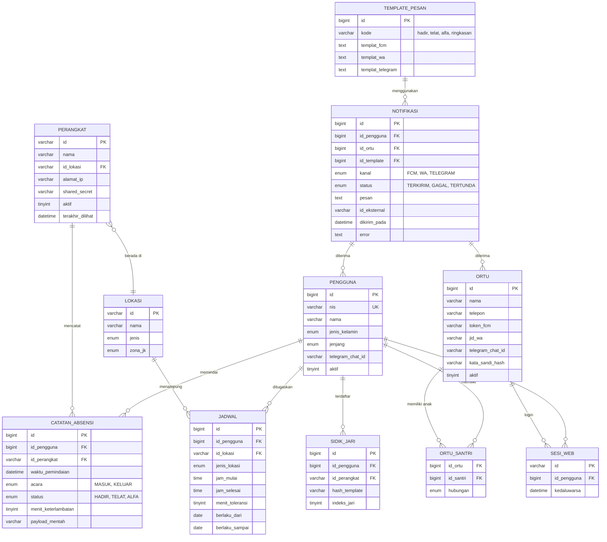

### Fitur Tambahan

- Notifikasi Firebase (FCM) gratis dan tidak terbatas untuk pesan push.
- WhatsApp Meta API untuk peringatan penting dengan template yang disetujui Meta.
- Notifikasi hibrida: FCM untuk pesan utama, WhatsApp untuk pesan penting, Telegram sebagai cadangan.
- Cron terjadwal: ringkasan harian jam 17.00, audit asrama jam 22.00.
- Ekspor laporan ke PDF dan Excel.
- Cache Redis untuk mengurangi beban MySQL pada query agregat.
- Web admin dengan grafik tren, filter multi-kelas, multi-cabang.

### Kelebihan

- Banyak saluran komunikasi (redundansi: kalau FCM gagal, WhatsApp atau Telegram jadi backup).
- Tampilan profesional.
- Siap untuk multi-cabang (cukup tambah kolom `id_cabang` di tabel).
- Audit trail lengkap (semua notifikasi tercatat di tabel `notifikasi`).

### Kekurangan

- Pengembangan lebih lama (8 minggu).
- Biaya WhatsApp Meta per pemindaian bisa mahal (opsional, bisa dinonaktifkan).
- Perlu monitoring cache Redis (kalau penuh, query lambat).

---

## Konsep 5: Mobile App (APK) — Dashboard & Pelaporan Lewat Aplikasi

> **Inti:** tanpa web sama sekali. Semua interaksi wali **dan** admin lewat **aplikasi Android** (APK). Wali: notifikasi push + dashboard anak. Admin: approval izin, rekap, grafik, kelola santri — semuanya di HP.

**Biaya operasional:** di bawah Rp 600 ribu per bulan (VPS 4 GB + FCM gratis + publikasi APK).
**Waktu pengembangan:** 10 minggu (backend + 2 aplikasi Android).
**Kapasitas pengguna:** 500–2.000 pengguna.
**Saluran utama:** Notifikasi Push (FCM) + Aplikasi Mobile (Wali & Admin).

### Rancangan Aplikasi

| Aplikasi | Pengguna | Fitur inti |
|----------|----------|-----------|
| **APK Wali** | Wali/santri | Login (no. HP + OTP), dashboard status anak, riwayat absensi per bulan, notifikasi push per scan, ajukan izin/sakit (lampir foto), ubah pengaturan notifikasi |
| **APK Admin** | Admin/kepala pesantren | Dashboard realtime (siapa baru saja scan), approval izin/sakit, rekap kelas & asrama, grafik tren, kelola santri (CRUD), kelola perangkat (status 6 FP), ekspor laporan PDF/Excel, siarkan pengumuman |

**Teknologi aplikasi:** Flutter (1 basis kode → APK Android + opsi iOS nanti) atau React Native. Distribusi: APK langsung (sideload) atau Play Store (biaya $25 sekali). Notifikasi: Firebase Cloud Messaging (FCM) — gratis, tanpa batas jumlah.

**Penting:** **tidak ada website**. Backend tetap REST API yang sama, tapi tidak dibungkus halaman web. Semua konsumsi API dilakukan aplikasi mobile.

### DAD Level 0 — Konteks

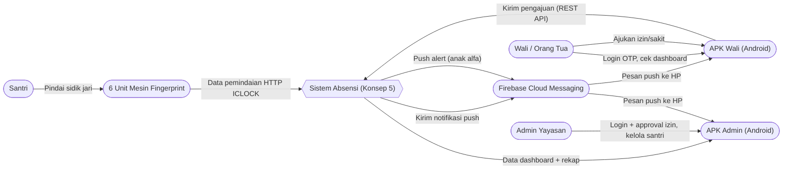

### DAD Level 1 — Dekomposisi Proses

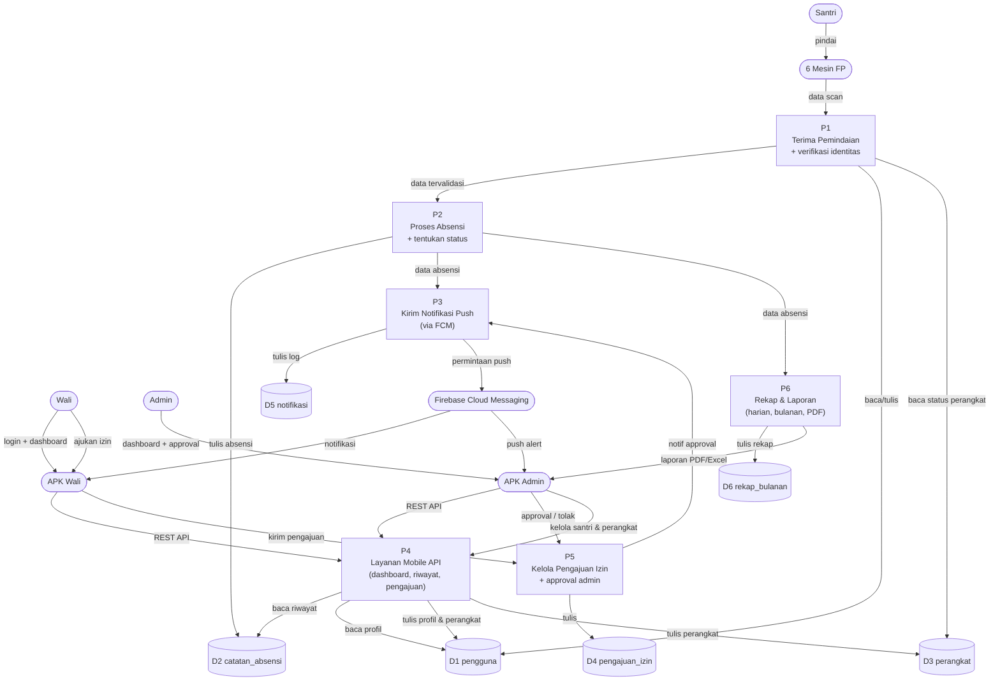

### Diagram Sekuens — Pemindaian + Pengajuan Izin via Aplikasi

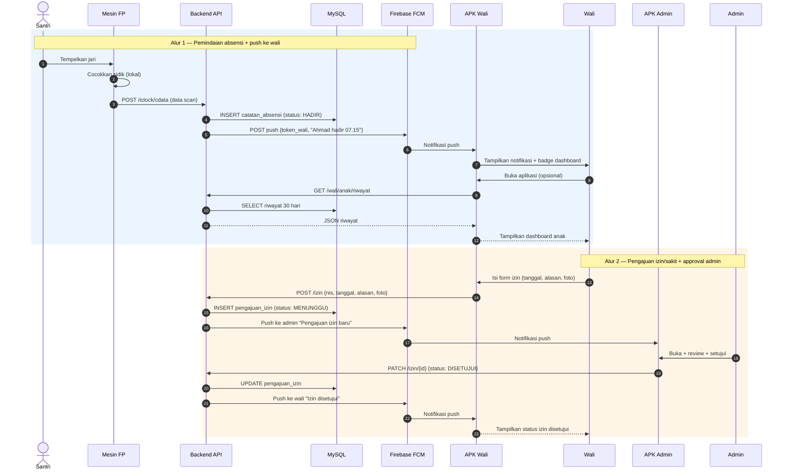

### ERD — Struktur Basis Data (tambahan modul mobile)

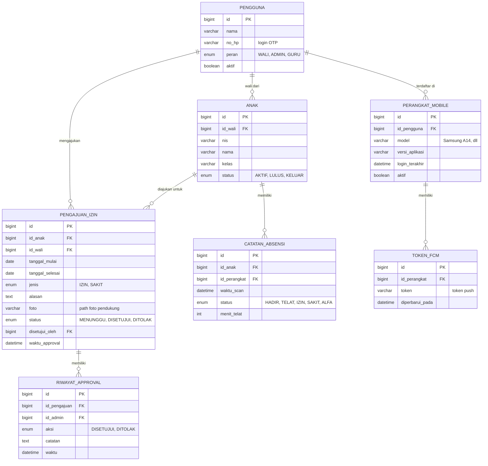

**Perbedaan ERD vs Konsep 2–4:** tabel `notifikasi` diganti `perangkat_mobile` + `token_fcm` (push per perangkat, bukan per saluran chat), plus 2 tabel baru `pengajuan_izin` + `riwayat_approval` (fitur izin via aplikasi).

### Alur Kerja Harian

| Waktu | Peristiwa |
|-------|-----------|
| 06.30 | Santri scan di FP asrama (absen pulang asrama) |
| 06.45 | Push ke HP wali: "Ananda hadir asrama 06.30" |
| 07.00 | Santri scan di FP kelas |
| 07.01 | Push: "Ananda hadir kelas 07.00" |
| Siang | Admin buka APK → dashboard realtime → lihat 3 santri belum scan |
| Siang | Wali ajukan izin via APK (anak sakit) → admin approve dari HP |
| 17.00 | Rekap harian otomatis → tersimpan + bisa diekspor PDF |
| 22.00 | Audit asrama otomatis → push alert kalau ada santri tidak pulang |

### Stack Teknis

```
backend/         → Node 20 + Express + Prisma + MySQL 8.4
                 → + firebase-admin (kirim FCM push)
                 → + endpoint REST khusus mobile (/wali/*, /admin/*, /izin/*)
                 → + penyimpanan foto pengajuan (lokal atau S3-compatible)
mobile/
  wali/          → Flutter (Dart) — APK Wali
  admin/         → Flutter (Dart) — APK Admin
fingerprint/     → Node 20 + node-zklib + TS (sama seperti konsep lain)
```

**Endpoint API mobile utama:**

| Endpoint | Metode | Fungsi |
|----------|--------|--------|
| `/auth/otp-kirim` | POST | Kirim OTP login ke no. HP |
| `/auth/otp-verifikasi` | POST | Verifikasi OTP → JWT |
| `/wali/dashboard` | GET | Status anak hari ini + badge |
| `/wali/riwayat?bulan=` | GET | Riwayat absensi per bulan |
| `/izin` | POST | Ajukan izin/sakit (multipart, lampir foto) |
| `/izin/{id}/approval` | PATCH | Admin setujui/tolak |
| `/admin/realtime` | GET | Feed scan realtime (polling 5 detik atau SSE) |
| `/admin/rekap?kelas=&bulan=` | GET | Rekap per kelas/bulan |
| `/admin/santri` | POST/PATCH | CRUD santri |
| `/admin/laporan/pdf` | GET | Ekspor laporan PDF |
| `/admin/siaran` | POST | Broadcast pengumuman push ke semua wali |

### Distribusi APK

| Cara | Biaya | Catatan |
|------|-------|---------|
| **Sideload APK** (kirim file ke HP wali) | Gratis | Perlu aktifkan "Install aplikasi tidak dikenal". Cocok mulai cepat |
| **Play Store** | $25 sekali (~Rp 440 ribu) | Update otomatis, lebih kredibel, perlu akun Google Play Console |
| **MDM/enterprise** (kalau yayasan punya) | Tergantung | Kontrol penuh, jarang perlu |

**Rekomendasi:** mulai sideload (cukup kirim APK via WhatsApp ke wali), pindah Play Store setelah stabil.

### Kelebihan

- ✅ Tanpa web sama sekali — semua lewat aplikasi di HP
- ✅ Dashboard & laporan visual di HP (wali + admin)
- ✅ Notifikasi push gratis dan instan (FCM)
- ✅ Fitur izin/sakit via aplikasi + approval admin dari HP (tidak perlu chat)
- ✅ Ekspor PDF/Excel langsung dari aplikasi
- ✅ Login OTP no. HP — wali tidak perlu ingat password
- ✅ Skalabel sampai 2.000 pengguna

### Kekurangan

- ❌ Waktu pengembangan terlama (10 minggu — 2 aplikasi + backend)
- ❌ Wali harus install APK (friction awal; sideload perlu izin "unknown source")
- ❌ HP wali harus online untuk notifikasi instan (push butuh internet)
- ❌ Perlu akun Firebase + Play Console (gratis/murah tapi setup tambahan)
- ❌ Kalau HP wali lawas (Android 7 ke bawah), kompatibilitas perlu dicek

---

## Panduan Memilih Konsep

| Kondisi                                                              | Konsep yang Disarankan |
|----------------------------------------------------------------------|------------------------|
| Bujet sangat terbatas (di bawah Rp 100 ribu per bulan) & yayasan baru mulai | Konsep 1                |
| Bujet di bawah Rp 200 ribu per bulan dan ingin stabilitas lebih baik       | Konsep 2                |
| Ingin dasbor visual untuk admin dengan bujet di bawah Rp 350 ribu per bulan | Konsep 3                |
| Lebih dari 500 pengguna dengan kebutuhan multi-cabang                       | Konsep 4                |
| Wali & admin ingin dashboard + laporan lewat aplikasi HP (APK), tanpa web   | Konsep 5                |

## Catatan Akhir

Semua konsep pada dokumen ini menggunakan enam unit fingerprint dengan penomoran FP1 sampai FP6 sesuai tabel penomoran di awal. Yayasan dapat memilih konsep berdasarkan bujet, kapasitas pengguna, dan kebutuhan fitur. Konsep 1 sampai 2 dapat dijalankan dengan biaya rendah dan waktu pengembangan singkat, konsep 3 sampai 4 memberikan fitur yang lebih lengkap (dasbor visual, multi-saluran notifikasi, multi-cabang), dan Konsep 5 menghadirkan dashboard + pelaporan penuh lewat aplikasi mobile.

## Lampiran: Mode Arsitektur ZKTeco (Lintas Konsep)

Semua 5 konsep pada dokumen ini menggunakan protokol transport yang **sama** untuk device ZKTeco:
- **Protokol**: PULL TCP socket :4370 dengan library `node-zklib` (lihat [[11-ZKTECO-TRANSPORT-PROTOCOL]])
- **Payload**: log absensi (uid, user_id, timestamp, status, punch) — **TIDAK** termasuk template sidik jari (lihat [[10-ZKTECO-DATA-PRIVACY]])
- **Mode koneksi** bervariasi per konsep (lihat [[09-ZKTECO-ARCHITECTURE-MODES]]):
  - Konsep 1, 2, 5 (server lokal pesantren): Mode 1 (langsung tanpa perantara)
  - Konsep 3, 4 (server cloud VPS): Mode 2 (Mini-PC gateway) atau Mode 1 via Cloudflare Tunnel

Untuk kebutuhan di atas 1.000 pengguna lintas yayasan, analitik prediktif, atau integrasi CCTV/RFID — di luar lingkup dokumen ini, dapat dievaluasi sebagai proyek terpisah.
