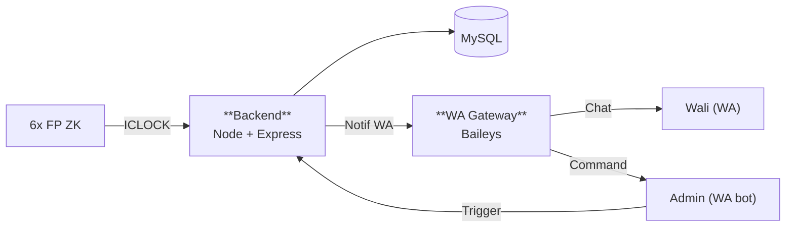
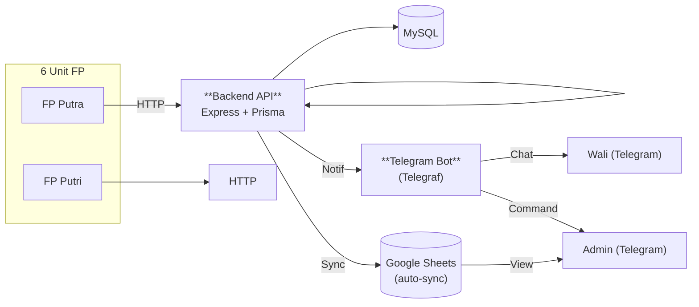
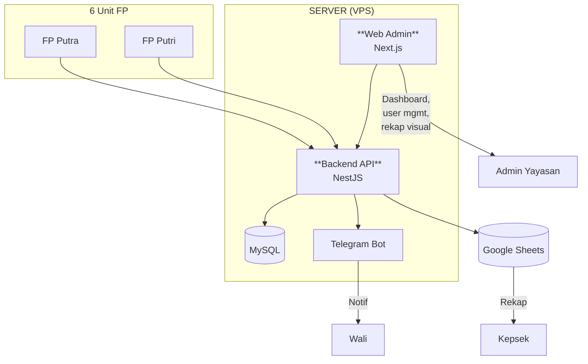
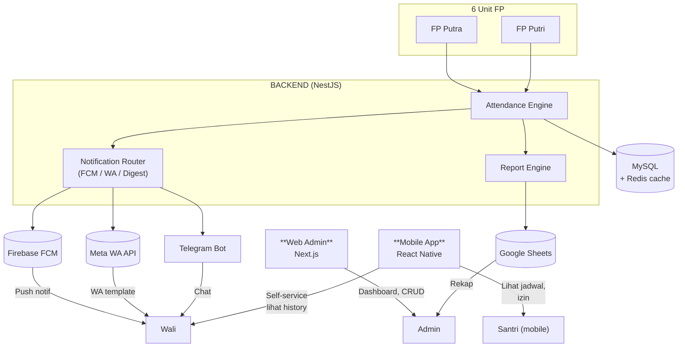
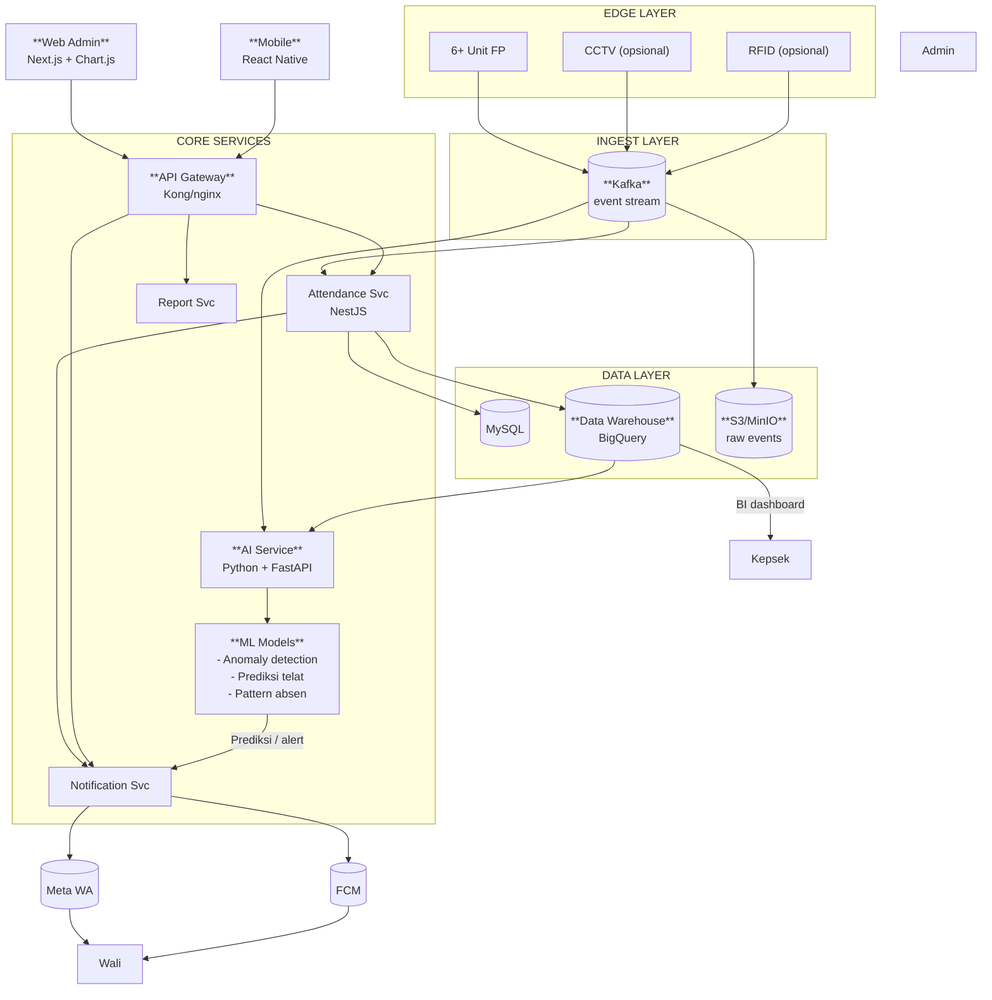
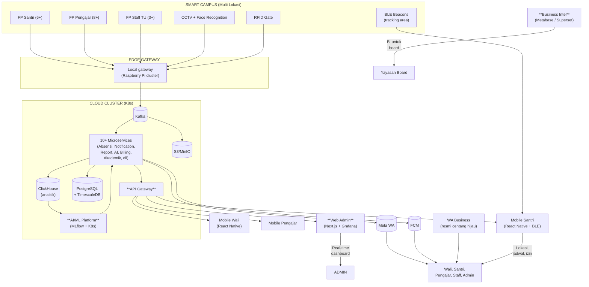

# 🎨 7 Konsep Sistem ABSENSI Fingerprint Pesantren

> **Spektrum dari paling murah (Konsep 1) sampai paling prestisius (Konsep 7).**
> User/yayasan pilih salah satu. Tiap konsep punya diagram sendiri, biaya, timeline, trade-off.

## 📊 Tabel Perbandingan Cepat

| # | Konsep | Wali Info | Admin Control | Biaya/bln | Dev | Cocok untuk |
|---|--------|-----------|---------------|-----------|-----|-------------|
| 1 | **Ultra-Mini (WA Gateway)** | WhatsApp gratis (Baileys) | WhatsApp bot | < Rp 50rb | 2 mgu | Yayasan hemat, < 100 user |
| 2 | **Mini Telegram** | Telegram | Telegram bot + Sheets | < Rp 150rb | 4 mgu | Mulai serius, < 300 user |
| 3 | **Lite Web + Telegram** | Telegram + Web | Web admin + Sheets | < Rp 300rb | 6 mgu | Standar pesantren, 300-500 |
| 4 | **Standard Web+FCM+WA** | FCM + WA | Web admin + Sheets | < Rp 500rb | 8 mgu | Multiple cabang, 500-1000 |
| 5 | **Pro Multi-Sekolah** | FCM + WA (Meta) | Web admin + Mobile app | Rp 1-2jt | 12 mgu | Multi pesantren, 1000+ |
| 6 | **Enterprise + AI** | FCM + WA (Meta) + AI prediksi | Web + Mobile + AI | Rp 2-5jt | 16 mgu | Yayasan besar + predictive |
| 7 | **Premium Real-time** | Semua channel + CCTV + RFID | Dashboard + Mobile + AI + Biometric absensi pengajar | Rp 5-10jt | 24 mgu | Full smart-school |

**Detail masing-masing + diagram ada di bawah.**

---

## 🟢 Konsep 1: Ultra-Mini (WA Gateway Saja)

**Biaya:** < Rp 50rb/bulan (VPS 2GB) + listrik
**Dev time:** 2 minggu
**Pengguna:** Yayasan sangat hemat, 50-200 user

**Cara kerja:**
- Fingerprint → backend API → MySQL
- Backend push ke WA via Baileys (unofficial)
- Wali terima WA chat per scan
- Admin CRUD via WA bot (kirim `/daftar Ahmad 24001`)
- Rekap: query langsung ke MySQL via CLI/phpMyAdmin

**Pro:** Sangat murah, dev cepat, wali sudah punya WA
**Kontra:** Risiko banned WA (unofficial), admin operasi via WA, tidak ada visual

---

## 🔵 Konsep 2: Mini Telegram (No Web)

**Biaya:** < Rp 150rb/bulan
**Dev time:** 4 minggu
**Pengguna:** 200-400 user

**Fitur tambahan dari Konsep 1:**
- Telegram bot (lebih stabil dari WA Baileys)
- Auto-sync ke Google Sheets untuk rekap
- Schedule/izin via bot command
- 9 command admin (daftar, hapus, rekap, broadcast, dll)

**Pro:** Stabil, rekap otomatis, free Telegram API
**Kontra:** Wali harus install Telegram, tidak ada web visual

---

## 🟡 Konsep 3: Lite Web + Telegram

**Biaya:** < Rp 300rb/bulan
**Dev time:** 6 minggu
**Pengguna:** 300-500 user

**Fitur tambahan:**
- Web admin dashboard (Next.js + Tailwind)
- Login admin (JWT)
- CRUD user/device/schedule via UI
- Rekap visual (chart per kelas, filter by date)
- Export PDF/Excel
- Telegram untuk wali (tetap), Sheets untuk rekap

**Pro:** Visual dashboard, onboarding device cepat, wali tetap pakai Telegram
**Kontra:** Ada web dev cost (1 minggu extra), admin perlu training

---

## 🟠 Konsep 4: Standard Web + FCM + WA

**Biaya:** < Rp 500rb/bulan (atau Rp 13.5jt/bln kalau Meta WA per scan)
**Dev time:** 8 minggu
**Pengguna:** 500-1000 user (multi-kelas, multi-cabang)

**Fitur tambahan:**
- Mobile app wali (React Native) — self-service
- Mobile app santri — lihat jadwal, izin online
- FCM (gratis unlimited) untuk push
- Meta WA API untuk alert kritis (template disetujui Meta)
- Hybrid notif: FCM primary, WA critical, Telegram fallback

**Pro:** Mobile app modern, multi-channel, professional
**Kontra:** Dev lebih lama, biaya Meta WA (kalau pakai), 2 app to maintain

---

## 🔴 Konsep 5: Pro Multi-Sekolah

**Biaya:** Rp 1-2jt/bulan (Meta WA + server lebih besar)
**Dev time:** 12 minggu
**Pengguna:** Multi pesantren / 1000+ user

```mermaid
flowchart TB
    subgraph CABANG["Multi-Cabang"]
        C1["Pesantren A<br/>(6 FP)"]
        C2["Pesantren B<br/>(6 FP)"]
        C3["Pesantren C<br/>(6 FP)"]
    end

    subgraph BE["BACKEND CLUSTER"]
        LB["Load Balancer<br/>nginx"]
        API1["Backend 1<br/>NestJS"]
        API2["Backend 2<br/>NestJS"]
        DB_M["**MySQL Master**"]
        DB_S["MySQL Slave<br/>(read replica)"]
        RDS[("Redis cluster")]
    end

    FRONT["**Web Admin**<br/>Multi-tenant"]
    MOBILE_W["Mobile Wali<br/>(React Native)"]
    MOBILE_S["Mobile Santri<br/>(React Native)"]
    META[("Meta WA")]
    FCM[("FCM")]
    SH[("Google Sheets<br/>/ BigQuery")]
    ADMINS["Admin Multi-sekolah"]

    C1 --> LB
    C2 --> LB
    C3 --> LB
    LB --> API1
    LB --> API2
    API1 --> DB_M
    API2 --> DB_M
    DB_M --> DB_S
    API1 --> RDS
    API2 --> RDS
    API1 --> META
    API1 --> FCM
    API1 --> SH
    FRONT -->|"Multi-tenant<br/>login per cabang"| ADMINS
    MOBILE_W --> API1
    MOBILE_S --> API1
```

**Fitur tambahan:**
- Multi-tenant (1 server untuk banyak pesantren)
- Load balancer + DB replication
- BigQuery untuk analitik cross-cabang
- Mobile app wali & Santri (fitur lengkap)
- Role-based access (admin cabang vs admin pusat)

**Pro:** Scalable, multi-sekolah, redundant
**Kontra:** Setup cluster butuh DevOps, biaya lebih tinggi, izin Meta WA

---

## 🟣 Konsep 6: Enterprise + AI

**Biaya:** Rp 2-5jt/bulan
**Dev time:** 16 minggu
**Pengguna:** Yayasan besar, 1000+ dengan predictive analytics

**Fitur tambahan dari Konsep 5:**
- **AI/ML predictions:**
  - Prediksi telat berdasarkan history
  - Deteksi anomali (kemungkinan titip absen, double scan dari device berbeda)
  - Pattern absen (SMP vs SMA, shift masjid)
- Event streaming (Kafka) untuk real-time
- Data warehouse (BigQuery) untuk analitik lanjutan
- CCTV integration (opsional, face recognition cross-check)

**Pro:** Predictive, modern stack, future-proof
**Kontra:** Butuh ML engineer, biaya tinggi, kompleksitas tinggi

---

## ⚫ Konsep 7: Premium Real-time (Full Smart-School)

**Biaya:** Rp 5-10jt/bulan
**Dev time:** 24 minggu (6 bulan)
**Pengguna:** Full smart-school (santri + pengajar + staff)

**Fitur tambahan dari Konsep 6:**
- **Multi-role:** Santri, pengajar, staff TU, admin
- **Biometric untuk semua:** FP untuk pengajar, staff
- **BLE tracking:** deteksi area (masuk kelas, masjid, asrama)
- **Akademik:** nilai, jadwal, rapor digital
- **Billing:** SPP online (Midtrans/Xendit)
- **Real-time dashboard:** Grafana + websocket
- **Full Kubernetes:** auto-scaling, zero-downtime deploy
- **Business Intelligence:** Metabase/Superset untuk yayasan board
- **Compliance:** ISO 27001-ready, GDPR-aware

**Pro:** Smart-school penuh, future-proof 5-10 tahun
**Kontra:** Butuh tim 3-5 orang, biaya tinggi, butuh full-time DevOps

---

## 🎯 Rekomendasi Berjenjang

### Untuk 1 pesantren (1 yayasan):
- **< 100 user:** Konsep 1 (WA) atau 2 (Telegram)
- **100-500 user:** Konsep 3 (Lite Web) ⭐ recommended
- **> 500 user:** Konsep 4 (Standard)

### Untuk multi pesantren (yayasan punya banyak cabang):
- Konsep 5 (Pro Multi-Sekolah) ⭐

### Untuk yayasan besar dengan strategic plan 3-5 tahun:
- Konsep 6 atau 7

### Kapan mulai dari Konsep 1 dan upgrade:
- **Step 1:** Mulai dengan Konsep 1 atau 2 (1-2 bulan running)
- **Step 2:** Eval 3 bulan — kalau wali/admin butuh web → upgrade ke Konsep 3
- **Step 3:** Kalau 500+ user → upgrade ke Konsep 4
- **Step 4:** Multi-cabang → Konsep 5
- **Path migration zero-refactor:** API contract tetap sama, frontend bisa ditambah tanpa ubah backend

## 💡 Tips Memilih

1. **Hitung break-even:** Konsep 3 balik modal dalam 4-6 bulan (admin hemat waktu, ortu lebih puas)
2. **Pikirkan 2 tahun ke depan:** Jangan pilih terlalu kecil kalau growth cepat
3. **Pilih sesuai skill tim:** Kalau ada Flutter dev, Konsep 4 mulus
4. **Konsultasi user:** Wali lebih suka apa — WA (sudah punya) atau Telegram (install baru) atau mobile app (install baru)?

## See Also

- `02-SYSTEM-DIAGRAMS.md` — Diagram engineering detail (Konsep 4)
- `03-NO-WEB-SOLUTION.md` — Detail Konsep 2 (Mini Telegram)
- `proposal_absensi_fingerprint_pesantren.md` — Proposal client
