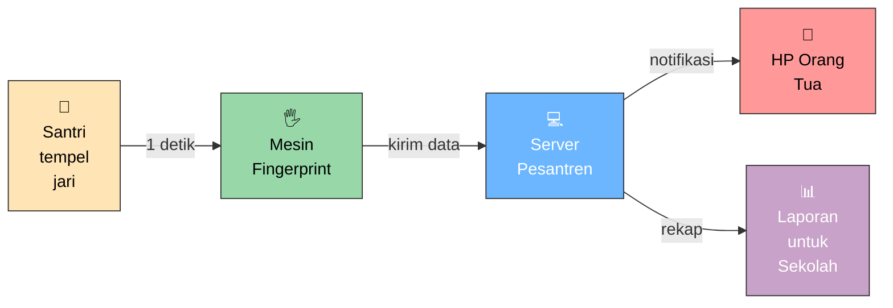
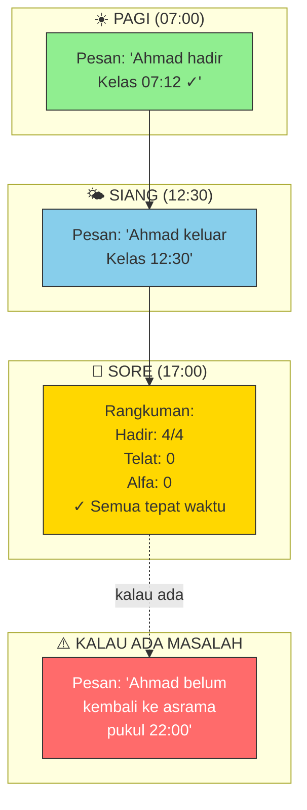
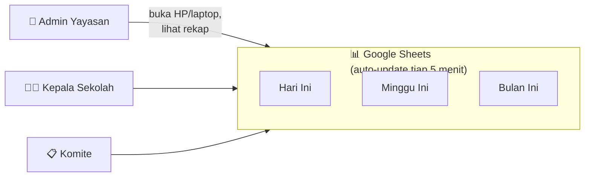
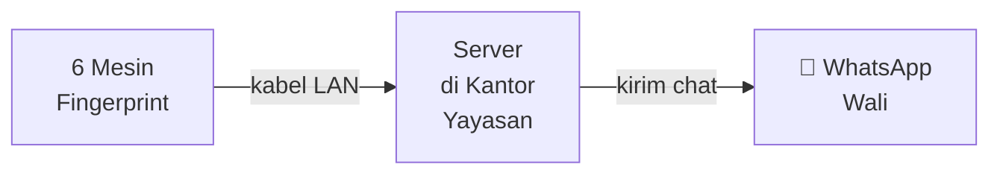
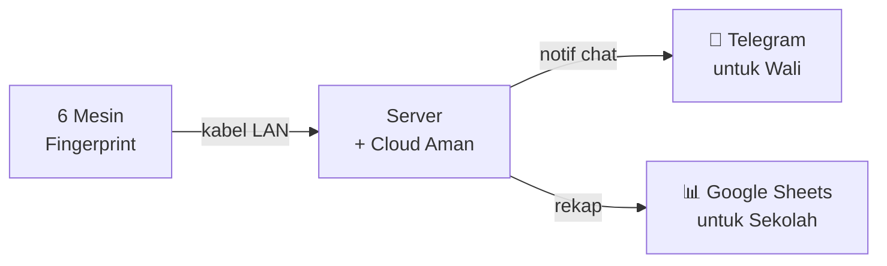
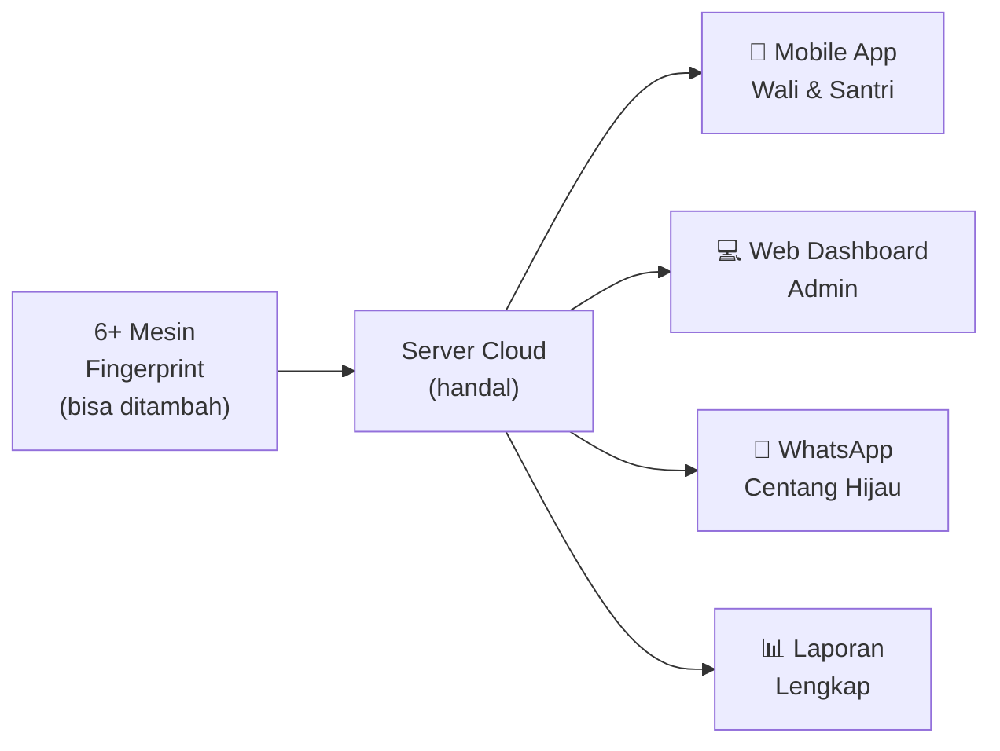

# 📖 Visual Penjelasan Sistem (untuk Yayasan & Wali)

> **Narasi friendly** untuk presentasi ke pihak yayasan, kepala sekolah, komite, dan wali. Bukan teknikal — fokus **"gimana sistem bantu kehidupan sehari-hari"**.

---

## 🎬 Cerita: "Pagi Hari di Pesantren"

Bayangkan hari biasa di pesantren. Pukul 06.45, bel berbunyi. **Ratusan anak** berlari dari asrama, wudhu, ke masjid untuk Sholat Subuh berjamaah.

**Dulu:**
> *Santri A sampai masjid, antri sidik jari, mesin bunyi "tut-tut-tut" (gagal), coba lagi, ketiga kalinya baru bisa. Mesin cetak struk thermal. Puluhan anak antri di belakang. Sampai kelas, telat 15 menit.*

**Sekarang (dengan sistem kami):**
> *Santri tempelkan jari di mesin. 1 detik, beep "✓". Santri lanjut ke kelas. **Di HP ibu di rumah**, bunyi notifikasi Telegram: "Ahmad hadir Sholat Subuh 06:48 ✓". Ibu senyum, lanjut masak.*

---

## 🖐️→📱 Alur 5 Langkah (Simpel)

**5 langkah, 1 detik total, gak pakai antri.**

---

## 📱 Apa yang Wali Lihat di HP-nya

**Ibu tahu anaknya aman, tanpa harus telepon pesantren.**

---

## 🏫 Apa yang Sekolah Lihat (untuk Kepala Sekolah / Admin)

**Rekap absen** langsung muncul di Google Sheets, tinggal lihat di HP.

### Tampilan Google Sheets (Simpel)

| Waktu | Santri | Lokasi | Status |
|-------|--------|--------|--------|
| 07:12 | Ahmad F. | Kelas | ✓ Hadir |
| 07:15 | Budi S. | Kelas | ✓ Hadir |
| 07:18 | Citra L. | Kelas | ⏰ Telat 3 mnt |
| - | Dewi A. | - | ❌ Alfa |
| 12:30 | Ahmad F. | Kelas | ✓ Pulang |
| ... | ... | ... | ... |

---

## 🔄 3 Versi Sistem (Pilih yang Cocok)

### 🟢 Versi MURAH — cocok untuk yayasan hemat
**Biaya:** cuma listrik + server lokal  
**Wali dapat info lewat:** WhatsApp  
**Cocok untuk:** pesantren kecil, < 200 anak

**Cara kerja:**
- Pasang 6 mesin fingerprint di 6 lokasi
- Colok ke server (PC) di kantor
- Setiap scan, wali langsung dapat chat WhatsApp
- Selesai. Gak perlu install app, gak perlu HP baru

---

### 🟡 Versi STANDAR — paling pas untuk pesantren Indonesia
**Biaya:** ± Rp 200-300rb/bulan  
**Wali dapat info lewat:** Telegram (aplikasi chat gratis)  
**Admin dapat rekap lewat:** Google Sheets  
**Cocok untuk:** pesantren 200-500 anak

**Cara kerja:**
- Sama seperti versi murah, TAPI wali install Telegram (gratis, seperti WhatsApp)
- Sekolah bisa lihat rekap di Google Sheets (gratis, tinggal buka di HP)
- Data aman di server lokal + backup cloud
- Admin bisa tambah/hapus siswa via chat Telegram juga

---

### 🔵 Versi LENGKAP — untuk pesantren besar / multi-cabang
**Biaya:** ± Rp 1-2 juta/bulan  
**Wali dapat info lewat:** Telegram + WhatsApp + Mobile App  
**Sekolah punya:** Web dashboard modern  
**Cocok untuk:** 500+ anak, atau yayasan dengan banyak pesantren

**Cara kerja:**
- Mobile app untuk wali (lihat history, izin online)
- Web dashboard untuk admin (chart, statistik, export PDF)
- WhatsApp resmi Meta (centang hijau, lebih dipercaya)
- Cocok kalau ada multi-cabang (1 server untuk semua)

---

## 🤔 Pertanyaan yang Sering Ditanya Orang Tua

### "Kalau HP saya mati / gak ada sinyal, gimana?"
> Santri **tetap bisa absen** normal di mesin fingerprint. Data tersimpan di server. Notifikasi terkirim **nanti** kalau HP nyala / ada sinyal.

### "Kalau listrik mati di pesantren?"
> Setiap mesin fingerprint punya **baterai cadangan 4-8 jam**. Data scan tersimpan di mesin. Kalau listrik nyala, data **otomatis terkirim** ke server. Wali baru dapat notifikasi setelah server hidup.

### "Kalau anak titip absen (kirim temennya)?"
> Setiap orang punya **sidik jari unik** (kemungkinan sama 1 dari 64 miliar). Gak bisa titip. Plus sistem bisa deteksi anomali (scan dari 2 tempat berbeda dalam 1 menit = alert).

### "Berapa biaya langganan per bulan?"
> Tergantung versi:
> - Versi Murah: **< Rp 100rb/bulan** (cuma listrik)
> - Versi Standar: **Rp 200-300rb/bulan**
> - Versi Lengkap: **Rp 1-2jt/bulan**
> 
> Bandingkan dengan biaya operasional absen manual (kertas, alat tulis, admin input) yang **jauh lebih mahal** jangka panjang.

### "Apakah data anak aman?"
> **Ya.** Data tersimpan di server lokal pesantren (tidak keluar ke cloud sembarangan). Backup otomatis. Akses dibatasi (wali cuma lihat data anaknya sendiri, bukan anak lain).

---

## 📊 Perbandingan 3 Versi (Simpel)

| | 🟢 Murah | 🟡 Standar ⭐ | 🔵 Lengkap |
|---|:---:|:---:|:---:|
| **Biaya/bulan** | < Rp 100rb | Rp 200-300rb | Rp 1-2jt |
| **Notif wali** | WhatsApp | Telegram | Semua |
| **Rekap sekolah** | Manual | Sheets | Web + Sheets |
| **Mobile app** | - | - | ✅ |
| **Cocok untuk** | < 200 anak | 200-500 ⭐ | 500+ / multi |
| **Waktu install** | 1-2 minggu | 1 bulan | 2-3 bulan |

**Rekomendasi:** **Versi Standar** paling pas untuk kebanyakan pesantren Indonesia.

---

## 🎯 Kenapa Sistem Ini Bantu?

### Untuk Wali:
- ✅ **Tenang** — tahu anak aman tanpa telepon
- ✅ **Transparan** — bisa lihat history absen
- ✅ **Gratis** — gak ada biaya tambahan untuk wali
- ✅ **Privat** — cuma wali sendiri yang tahu

### Untuk Sekolah:
- ✅ **Hemat waktu** — gak perlu input manual
- ✅ **Akurat** — gak ada human error
- ✅ **Realtime** — tahu detik ini juga siapa yang hadir
- ✅ **Laporan** — rekap bulanan otomatis

### Untuk Yayasan:
- ✅ **Murah** — investasi sekali, biaya operasional kecil
- ✅ **Modern** — image yayasan naik
- ✅ **Skalabel** — tambah cabang tinggal colok mesin baru
- ✅ **Audit-ready** — data jelas untuk inspeksi

---

## 📞 Cara Mulai

1. **Diskusi** (gratis, 1 jam) — kami jelaskan detail, dengar kebutuhan yayasan
2. **Survey** (gratis) — tim datang, cek 6 titik, ukur kabel
3. **Penawaran resmi** — harga, timeline, kontrak
4. **Instalasi** (1-2 minggu) — pasang mesin, setup server, testing
5. **Training** (1 hari) — admin & guru belajar pakai
6. **Go-live** — jalan!
7. **Support** (1 tahun gratis) — kami bantu kalau ada masalah

**Tidak ada biaya tersembunyi. Tidak ada lock-in. Tidak ada tagihan mendadak.**

---

## 📂 Lampiran Teknis (untuk Tim IT)

File-file teknis yang sudah kami siapkan:

| File | Untuk siapa | Isi |
|------|-------------|-----|
| `04-MULTI-CONCEPT-7-SCHEMAS.md` | Tim IT | 7 konsep detail + spektrum biaya |
| `02-SYSTEM-DIAGRAMS.md` | Tim IT | 6 diagram engineering (DFD, sequence, ERD) |
| `03-NO-WEB-SOLUTION.md` | Tim IT | Detail versi Standar |
| `SERVER_NETWORK_DEPLOYMENT.md` | Tim IT | 3 skenario server + Cloudflare |
| `PORT_ALLOCATION.md` | Tim IT | Konvensi port + Docker |

> **File ini (yang sedang Anda baca)** adalah satu-satunya file yang ditunjukkan ke yayasan/wali. Sisanya adalah detail internal untuk tim IT yayasan.
