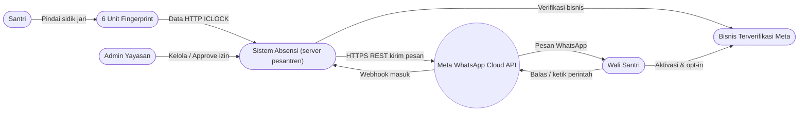
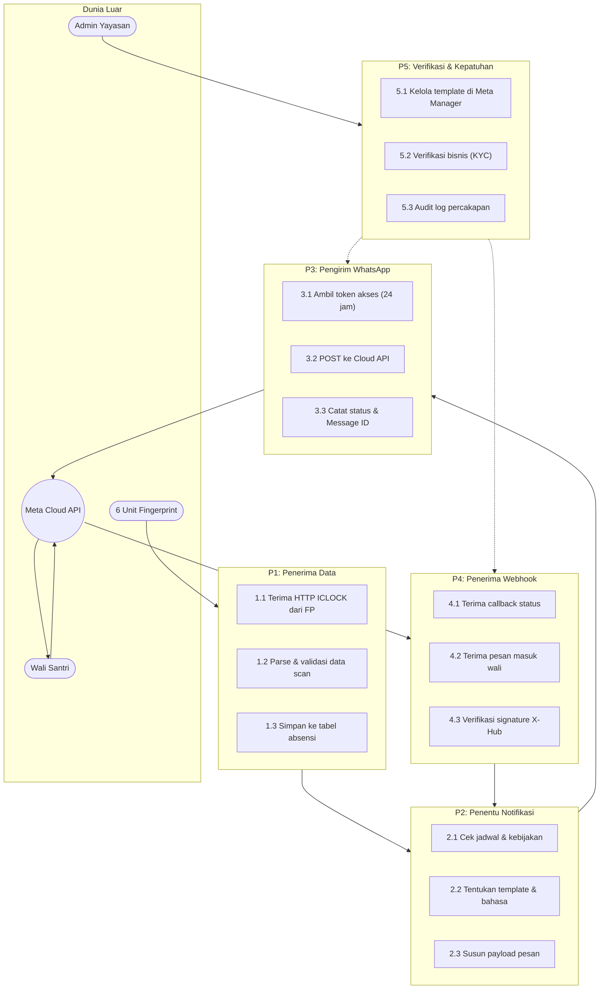
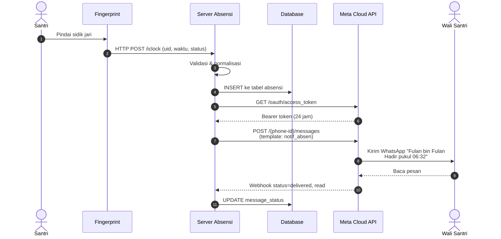
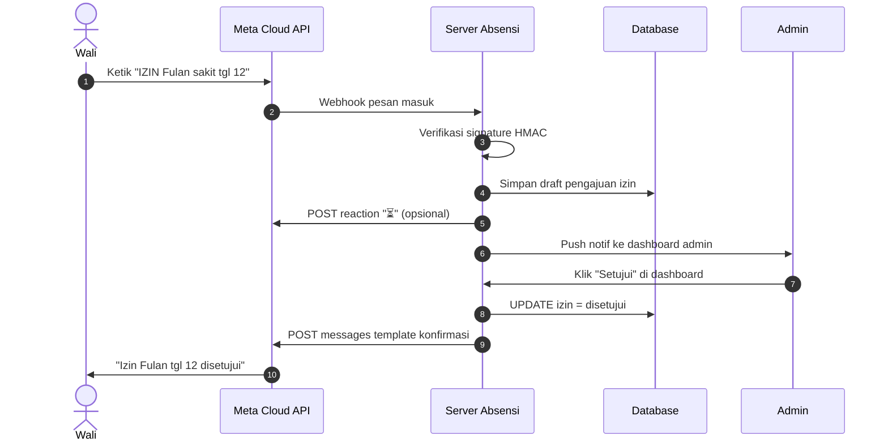
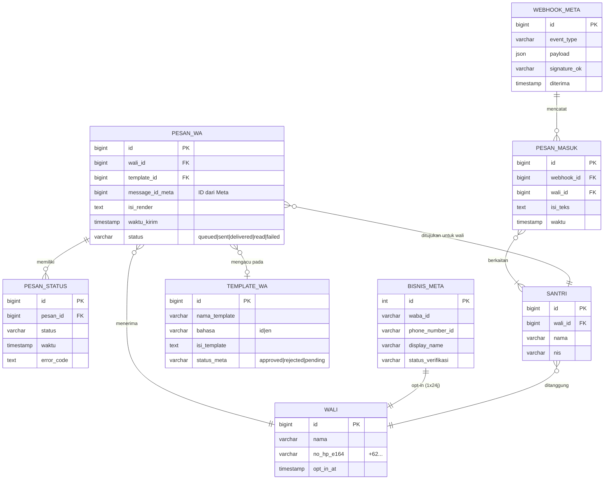

# Skema WhatsApp Jalur Resmi Meta

Dokumen ini khusus membahas pilihan **jalur resmi** untuk integrasi WhatsApp dengan sistem absensi fingerprint pesantren. Tidak menggunakan *library* tidak resmi seperti Baileys atau *reverse-engineered* WhatsApp Web karena berisiko pemblokiran nomor, perubahan *protocol* sepihak Meta, dan tidak patuh terhadap aturan Meta Platform.

---

## 1. Mengapa Jalur Resmi Meta

| Aspek                         | Tidak Resmi (Baileys, WA Web)        | Jalur Resmi Meta (Cloud API / On-Premises)              |
| ----------------------------- | ------------------------------------ | ------------------------------------------------------- |
| Status hukum                  | Melanggar ToS Meta, rawan banned     | Sepenuhnya patuh                                        |
| Stabilitas protokol           | Berubah sewaktu-waktu (butuh *patch*) | Dijamin stabil oleh Meta, SLA 99,9%                     |
| Risiko blokir nomor           | Tinggi, bisa permanen                | Sangat rendah, *business account* resmi                |
| Biaya awal                    | Rp 0 (tetapi ada biaya risiko)       | Meta Cloud API: Rp 0 setup; On-Premises: ~$0,5K lisensi |
| Biaya percakapan              | Rp 0                                | Per percakapan (template) atau *utility window* gratis  |
| Kecepatan aktivasi            | 5 menit                             | 1-7 hari (verifikasi bisnis + penomoran)                |
| Cocok untuk pesantren         | Tidak disarankan (akun bisa lenyap)  | Sangat disarankan                                       |

---

## 2. Dua Jalur Resmi Meta

### A. Meta WhatsApp Cloud API (Direkomendasikan untuk Pesantren)

- **Penyedia:** Meta langsung (developers.facebook.com → WhatsApp → Getting Started)
- **Hosting:** Server Meta (tidak perlu instalasi server WA sendiri)
- **Akses API:** HTTPS REST ke `graph.facebook.com/v18.0/{phone-number-id}/messages`
- **Kelebihan:** setup cepat, gratis di sisi infrastruktur, skala otomatis
- **Kekurangan:** percakapan tetap ditagih per sesi

### B. WhatsApp On-Premises API (Self-Hosted)

- **Penyedia:** Meta langsung, tetapi *binary* dijalankan di server sendiri
- **Cocok untuk:** organisasi dengan regulasi data ketat (bank, militer)
- **Untuk pesantren:** **tidak perlu**, karena pesantren tidak punya kewajiban data residensial di server sendiri

### C. Business Solution Provider (BSP) Lokal

- **Penyedia:** WATI, Qontak, Mista, Gupshup, Sleekflow, Verloop, dan lain-lain
- **Kelebihan:** UI dashboard, template builder visual, support lokal bahasa Indonesia, bantuan verifikasi Meta
- **Kekurangan:** biaya subscription Rp 200K–Rp 2jt/bulan di atas tagihan Meta
- **Cocok untuk:** yayasan yang tidak punya *dev* sendiri

> **Rekomendasi proyek absensi pesantren:** jalur **A (Cloud API langsung)** karena paling murah dan cukup untuk tim dev pesantren. Jika tim tidak punya *developer* khusus, pilih **jalur C dengan BSP** seperti WATI atau Qontak.

---

## 3. Arsitektur Integrasi

### DAD Level 0 — Konteks

### DAD Level 1 — Dekomposisi 5 Proses

### Diagram Sekuens — Scan Lalu Notifikasi

### Diagram Sekuens — Wali Ajukan Izin via WhatsApp

### ERD — Tabel Pendukung WhatsApp Resmi

---

## 4. Struktur Biaya (Meta Cloud API, per Agustus 2026)

### A. Biaya Meta Langsung (berdasarkan *conversation-based pricing* Indonesia)

| Kategori percakapan           | Volume pertama gratis/bln* | Tarif setelahnya       |
| ----------------------------- | -------------------------- | ---------------------- |
| *Utility* (notifikasi absen)  | 1.000                      | Rp 280 / percakapan    |
| *Authentication* (OTP)        | 1.000                      | Rp 350 / percakapan    |
| *Marketing* (siaran massal)   | 500                        | Rp 700 / percakapan    |
| *Service* (balasan 24 jam)    | 1.000                      | Rp 300 / percakapan    |

\*Tunjangan Meta berubah sewaktu-waktu; cek developers.facebook.com untuk tarif terkini. Asumsi pesantren 500 siswa dengan 2 notifikasi/hari = ~1.000 percakapan utility per hari kerja = ~22.000/bulan → di luar *free tier*, total sekitar **Rp 5-6 juta/bulan** untuk notifikasi saja.

### B. Biaya Setup Awal (sekali)

| Item                         | Biaya           |
| ---------------------------- | --------------- |
| Verifikasi bisnis Meta       | Rp 0            |
| Pembelian nomor baru         | Rp 0            |
| Setup WABA + Business Manager | Rp 0 (DIY)     |
| Template approval            | Rp 0            |
| **Total setup**              | **Rp 0** (kalau DIY) |

### C. Biaya jalur BSP (opsional, kalau tidak mau urus Meta sendiri)

| BSP              | Subscription/bln | Cocok untuk                              |
| ---------------- | ---------------- | ---------------------------------------- |
| WATI.io          | Rp 350K          | UI dashboard, integrasi Sheets           |
| Qontak           | Rp 500K–Rp 1,5jt | Multi-channel, laporan, agent handover   |
| Mista            | Rp 200K          | Murah, WhatsApp only                     |
| Sleekflow        | Rp 700K          | Sales/marketing + service                |

> **Rekomendasi biaya:** untuk pesantren 500 siswa, paling hemat adalah **Cloud API langsung + DIY integrasi** dengan biaya sekitar **Rp 5-6 juta/bulan hanya untuk notifikasi**. Jika ada bujet tambahan Rp 500K/bulan, tambahkan WATI untuk dasbor percakapan non-teknis.

---

## 5. Langkah Aktivasi (Cloud API)

1. **Buat Meta Business Manager** di business.facebook.com (gratis)
2. **Buat WhatsApp Business Account (WABA)** di dalam Business Manager
3. **Verifikasi bisnis** — unggah NPWP yayasan + KTP penanggung jawab (1-3 hari)
4. **Tambah nomor telepon** — bisa pakai nomor baru atau *porting* nomor lama
5. **Buat Message Templates** — minimal 4 template: notifikasi hadir, izin disetujui, pengumuman, OTP
6. **Submit template** untuk persetujuan Meta (umumnya < 1 jam untuk utility/auth)
7. **Buat sistem token** — simpan *permanent access token* dengan aman di server
8. **Setup webhook** untuk menerima pesan masuk & status update
9. **Implementasi SDK** — gunakan *library* resmi Meta Business SDK untuk Node.js
10. **Uji coba end-to-end** dengan nomor internal sebelum ke wali

---

## 6. Daftar *Library* Resmi yang Dipakai

- **Backend:** `whatsapp-business` SDK Node.js resmi Meta, atau HTTP client biasa ke Graph API
- **Validasi webhook:** implementasi sendiri HMAC-SHA256 terhadap header `X-Hub-Signature-256`
- **Template builder:** Meta Business Manager UI (tidak perlu kode)
- **Testing:** Meta menyediakan nomor test gratis untuk development

> **Dilarang keras** menggunakan *library* tidak resmi seperti Baileys, `whatsapp-web.js`, atau *scraper* WA Web di proyek ini karena melanggar ToS Meta dan dapat menyebabkan pemblokiran permanen.

---

## 7. Kapan Memilih Jalur Mana

| Situasi                                                  | Pilihan              |
| -------------------------------------------------------- | -------------------- |
| Tim punya *developer* sendiri, bujet operasional ketat   | Cloud API langsung (A) |
| Tim tidak punya *developer*, perlu dasbor percakapan     | BSP seperti WATI (C)   |
| Ada regulasi data yang mewatkan server di Indonesia      | On-Premises (B)        |
| Yayasan memiliki banyak cabang dengan audit berbeda      | Cloud API per cabang (A) |
| Anggaran sangat minim (< Rp 1 juta/bln)                  | Telegram dulu, WA menyusul |

---

## Catatan Akhir

Pemilihan jalur resmi Meta untuk integrasi WhatsApp adalah keputusan arsitektur yang **paling kritis** dalam proyek ini karena menentukan keandalan jangka panjang, risiko hukum, dan struktur biaya bulanan. Jalur Cloud API langsung direkomendasikan untuk pesantren pada umumnya, sementara jalur BSP layak dipilih jika tim tidak memiliki kemampuan teknis untuk mengelola token, template, dan webhook sendiri.
