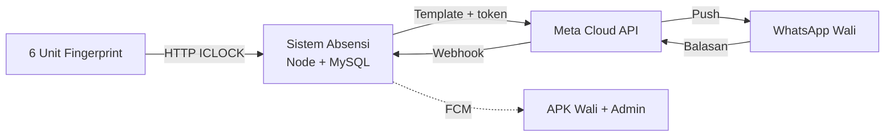

# Smart Pesantren Attendance System

> **Index note for this project.** Link ke PRD, session logs, knowledge notes di sini.

## TL;DR
Sistem absensi 6 unit fingerprint di pesantren (SMP & SMA, putra & putri) dengan 5 konsep arsitektur siap-pilih — dari WA-only (<Rp 100rb/bln) sampai Mobile App APK. WhatsApp pakai **jalur resmi Meta** (Cloud API). Mobile App pakai **Flutter + FCM**.

## Metadata
- **Date**: 2026-08-27 (started) · v3 2026-08-29
- **Category**: IoT & Biometric Attendance / WhatsApp Gateway / Mobile App
- **Client/Domain**: Yayasan Pesantren (SMP & SMA, Putra & Putri)
- **Local Repo Path**: `C:\Users\raiha\.gemini\antigravity\scratch\smart-pesantren-attendance-system`
- **Source of truth**: `D:\Obsidian\AI-Agents\20-Projects\01-absensi-finger\proposal_absensi_fingerprint_pesantren.md`

## 1. Problem Statement & Scope
Integrasi 6 unit fingerprint di 6 lokasi:
- **3 Mesin Santri Putra**: 1 Kelas Putra, 1 Masjid Putra, 1 Asrama Putra
- **3 Mesin Santri Putri**: 1 Kelas Putri, 1 Masjid Putri, 1 Asrama Putri
- **Tantangan**: Centralized Biometric Template Sync, Multi-Schedule (Sholat, Sekolah, Apel Malam), Notifikasi WhatsApp/App

## 2. Project Documents (5 file di `20-Projects/01-absensi-finger/`)
| File | Isi | Status |
|------|-----|--------|
| `proposal_absensi_fingerprint_pesantren.md` | Source of truth (spec lengkap) | ✓ v1 |
| `02-COUNCIL-stack-decision.md` | Keputusan stack (Pisah Repo + MySQL 8.4 + node-zklib) | ✓ |
| `02-SYSTEM-DIAGRAMS.md` | DFD, flowchart, sequence sistem terpilih | ✓ ID |
| `03-NO-WEB-SOLUTION.md` | Solusi tanpa web (Konsep 1/2 diperluas) | ✓ ID |
| `04-MULTI-CONCEPT-5-SCHEMAS.md` | **5 konsep arsitektur** (masing-masing DAD L0+L1+Sekuens+ERD) | ✓ ID v3 |
| `05-WA-META-OFFICIAL.md` | **Skema WhatsApp jalur resmi Meta** (Cloud API + BSP) | ✓ v1 |
| `diagrams/index.html` | Galeri 38 PNG diagram (render Mermaid 2× retina) | ✓ |

## 3. 5 Konsep Arsitektur (lihat `04-MULTI-CONCEPT-5-SCHEMAS`)
| # | Nama | Notifikasi | Biaya/bln | Waktu dev | Pengguna |
|---|------|------------|-----------|-----------|----------|
| 1 | Minimalis WhatsApp | WA Meta Cloud API | < Rp 100rb + percakapan | 4 minggu | < 200 |
| 2 | Minimalis Telegram | Telegram Bot + Sheets | < Rp 200rb | 5 minggu | < 300 |
| 3 | Ringan Web | Telegram + Web Admin | < Rp 350rb | 6 minggu | < 500 |
| 4 | Standar Multi-Saluran | Push + WA + Telegram | < Rp 500rb | 8 minggu | 500–1.000 |
| 5 | **Mobile App (APK)** | Push FCM + APK | < Rp 600rb | 10 minggu | 500–2.000 |

## 4. Keputusan WhatsApp (lihat `05-WA-META-OFFICIAL`)
- **Jalur resmi Meta** — Cloud API langsung atau via BSP (WATI, Qontak, Mista)
- **Dilarang**: Baileys, `whatsapp-web.js`, scraper WA Web (ToS Meta, risiko banned)
- **Rekomendasi**: Cloud API langsung (paling murah) atau BSP WATI (+Rp 350rb/bln untuk dasbor non-teknis)
- **Biaya Meta** (~Agustus 2026): utility Rp 280/percakapan, free tier 1000/bulan

## 5. Konsep Mobile App (lihat `04 Konsep 5`)
- **APK Wali**: push notif, riwayat anak, ajukan izin/sakit + foto
- **APK Admin**: dashboard realtime, approval izin, rekap & grafik, CRUD, ekspor PDF, siaran
- **Stack**: Flutter (1 basis, iOS-ready), FCM gratis, REST API
- **Distribusi**: sideload gratis dulu → Play Store ($25 sekali)
- **Tidak ada web sama sekali** untuk ortu/admin

## 6. Skema Server (lihat `60-Blueprints/SERVER_NETWORK_DEPLOYMENT`)
| Konsep | Skenario Server |
|--------|-----------------|
| K1 (WA-only) | A (offline-only, NAT lokal) |
| K2 (Telegram) | A atau B (Cloudflare Tunnel) |
| K3 (Ringan Web) | B (hybrid + tunnel) |
| K4 (Standar) | B atau C (cloud-native) |
| K5 (Mobile App) | B (VPS 4GB + tunnel untuk API mobile) |

## 7. Architecture (overview)

## 8. Decisions Log
| Date | Decision | Why | Alternative rejected |
|------|----------|-----|----------------------|
| 2026-08-28 | Pisah Repo + MySQL 8.4 + node-zklib | Council stack decision | PostgreSQL/Prisma (overkill) |
| 2026-08-29 | Hapus Konsep 5/6/7 (Multi-Sekolah, Enterprise, Premium) | Di luar lingkup pesantren tunggal | Keep 7 konsep |
| 2026-08-29 | Tambah Konsep 5 (Mobile App APK) | User minta non-web dashboard via APK | Skip mobile |
| 2026-08-29 | WhatsApp jalur resmi Meta | User minta, ToS-compliant, anti-banned | Baileys/unofficial |
| 2026-08-29 | Bahasa Indonesia penuh | User minta konsistensi | Mix EN-ID |

## 9. Session Logs
- [[30-Sessions/2026-08-29-lokalisasi-4-konsep-absensi]] — ID penuh + 4 konsep lengkap
- [[30-Sessions/2026-08-29-mobile-app-wa-meta]] — Konsep 5 APK + WA Cloud API

## 10. Related Knowledge
- [[50-Knowledge/Concepts/wa-meta-cloud-api]] — konsep WhatsApp Cloud API
- [[50-Knowledge/Concepts/mobile-app-fcm-absensi]] — Flutter + FCM untuk absensi
- [[50-Knowledge/Patterns/cloudflare-tunnel-self-host]] — tunnel zero-trust

## 11. Status
- **Current milestone**: M1 (desain & diagram selesai, menunggu klien pilih konsep)
- **Blockers**: Klien belum pilih konsep final (K1–K5)
- **Next action**: Setelah klien pilih → buat `90-ARCHITECTURE.md` (technical plan) + `90-DEV-SETUP.md`
