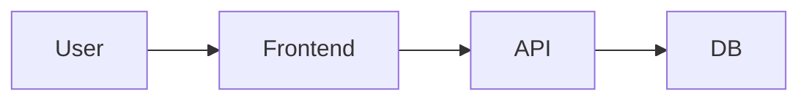

# <Project Name>

> **Index note for this project.** Link ke PRD, session logs, knowledge notes di sini.

## TL;DR
<1-3 kalimat: apa, untuk siapa, status sekarang>

## Spec
- [[PRD-<project-name>]] ← source of truth

## Architecture
<Mermaid diagram, ASCII, atau link ke file>

## Decisions Log
| Date | Decision | Why | Alternative rejected |
|------|----------|-----|----------------------|
| YYYY-MM-DD | <decision> | <reasoning> | <what we didn't pick> |

## Session Logs
- [[30-Sessions/YYYY-MM-DD-<topic>]]
- [[30-Sessions/YYYY-MM-DD-<topic>]]

## Related Knowledge
- [[50-Knowledge/Patterns/xxx]]
- [[50-Knowledge/Concepts/xxx]]

## Status
- **Current milestone:** M?
- **Blockers:** <apa>
- **Next action:** <apa yang akan dilakukan>
