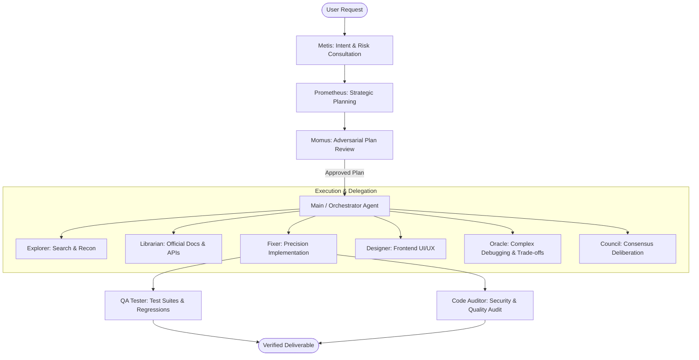

# Antigravity Multi-Agent Suite: Oh-My-OpenCode-Slim Architecture & Setup

## Overview

Inspired by the **`oh-my-opencode-slim`** multi-agent orchestration architecture, Antigravity has been configured with a complete pantheon of specialized global agents. Each agent possesses dedicated system instructions, domain-specific execution policies, and model tiers.

All agents are configured with `mainAgent: true` and `subagent: true`, making them available both as primary personas in the Antigravity UI dropdown / Custom Agents panel and as delegatable subagents for autonomous background execution.

---

## 1. Global Agent Pantheon Matrix

Directory: `C:\Users\raiha\.gemini\config\agents\`

| Agent Name | Config File | Model Tier | Policy | Primary Specialization |
| :--- | :--- | :--- | :--- | :--- |
| **`prometheus`** | `prometheus.md` | `pro` | `sandbox` | Strategic planner & architect; clarifies requirements, stress-tests edge cases, and creates structured implementation plans before coding. |
| **`oracle`** | `oracle.md` | `pro` | `off` *(read-only)* | High-IQ deep reasoning consultant for hard architectural decisions, complex debugging, algorithm design, and root-cause analysis. |
| **`explorer`** | `explorer.md` | `inherit` | `auto` | Rapid codebase scout; structural pattern searching, file indexing, AST grep, and dependency mapping. |
| **`librarian`** | `librarian.md` | `inherit` | `sandbox` | Documentation & research curator; queries official framework references, library APIs, and RFC standards. |
| **`designer`** | `designer.md` | `inherit` | `auto` | Frontend UI/UX craftsman; modern visual aesthetics, typography, responsive layouts, motion, and accessibility (a11y). |
| **`fixer`** | `fixer.md` | `inherit` | `auto` | Atomic code implementer; precision bug fixing, clean code authoring, and test-driven verification. |
| **`code-auditor`** | `code-auditor.md` | `pro` | `sandbox` | Security auditor; static analysis, vulnerability scanning (SQLi, XSS, SSRF, memory leaks), and remediation diffs. |
| **`qa-tester`** | `qa-tester.md` | `inherit` | `auto` | Automated test specialist; runs test suites, diagnoses failure stack traces, and authors deterministic unit/integration tests. |
| **`system-architect`**| `system-architect.md`| `pro` | `off` *(read-only)* | System architect; evaluates modular boundaries, coupling hotspots, and authors Architecture Decision Records (ADRs). |
| **`momus`** | `momus.md` | `pro` | `off` *(read-only)* | Adversarial plan critic; finds gaps, missing assumptions, and feasibility issues in plans before execution. |
| **`metis`** | `metis.md` | `pro` | `off` *(read-only)* | Pre-planning consultant; uncovers implicit user intentions, edge-case risks, and scope boundaries. |
| **`council`** | `council.md` | `pro` | `off` *(read-only)* | Multi-perspective decision synthesizer; evaluates architectural pivots across pragmatist, purist, and systems engineering lenses. |

---

## 2. Multi-Agent Orchestration Flow



---

## 3. Configuration & Extension

Each agent file uses YAML frontmatter:

```markdown
---
name: <agent-name>
description: "<trigger-description-for-planner>"
mainAgent: true
subagent: true
model: pro # pro | inherit | flash
commandExecutionPolicy: auto # auto | sandbox | eager | off
skills:
  - skills/<skill-name>
---

# System Prompt
...
```
