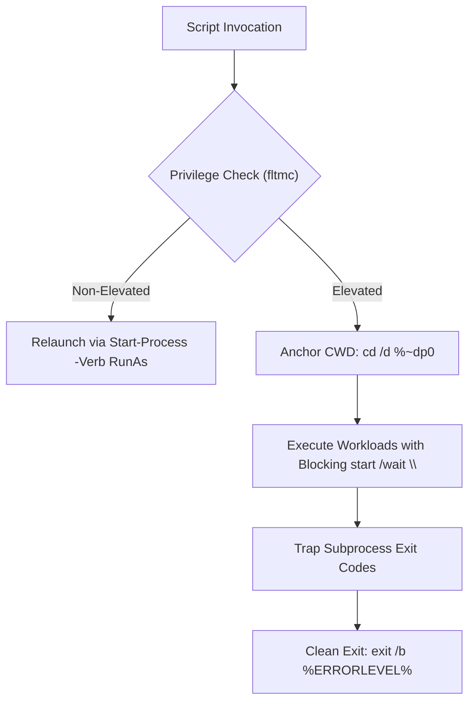

---
tags:
  - windows-10
  - deployment
  - batch-scripting
  - session0
  - setupcomplete
  - odt-office
created: 2026-08-23
aliases:
  - SetupComplete Session 0 Architecture
  - Enterprise Batch Hardening Standards
---

# Windows SetupComplete & Session 0 Enterprise Scripting Architecture

## 1. High-Reliability Batch Standards

### Critical Rules Matrix
| Area | Anti-Pattern / Bug | Enterprise Standard |
| :--- | :--- | :--- |
| **Privilege Verification** | `net session >nul 2>&1` (fails if Server service stopped) | `fltmc >nul 2>&1` (instant filesystem filter check) |
| **Working Directory** | Assuming CWD is script folder after UAC elevation | Explicit `cd /d "%~dp0"` on line 1-5 |
| **Start /Wait Syntax** | `start /wait "C:\Path\App.exe"` (First quoted string treated as Title) | `start /wait "" "C:\Path\App.exe"` (Explicit empty title quotes) |
| **ODT Working Directory** | Calling `setup.exe /configure` from arbitrary paths | `pushd "%APPS_DIR%Office2019"` ... `popd` |
| **Child Script Calling** | Bare script invocation (terminates parent immediately) | Explicit `call "%SCRIPT_PATH%"` |
| **Default User Registry** | Writing to `HKCU` in `SetupComplete.cmd` (maps to SYSTEM) | `reg load "HKU\DefaultUser" "%SystemDrive%\Users\Default\NTUSER.DAT"` |

---

## 2. SetupComplete.cmd Lifecycle in Windows 10 22H2

1. **Identity & Privileges:** Runs as `NT AUTHORITY\SYSTEM` with maximal local privileges.
2. **Session Context:** Non-interactive Session 0. Any GUI popups, UAC prompts, or confirmation dialogs cause infinite system hang.
3. **Execution Guarantee:** Must deploy with KMS Client / GVLK product key (`W269N-WFGWX-YVC9B-4J6C9-T83GX` for Pro) in `autounattend.xml` to prevent OEM key suppression.

---

## 3. Related Documents
- [[GTP_CUSTOM_ISO_BUILDER]]
- [[Win10_Physical_Deployment_OOBE_UAC_Office_Fixes]]
- [[Office_2019_ODT_Offline_Deployment_Architecture]]
- [[GTP_Fleet_Hardware_And_Driver_Matrix]]
