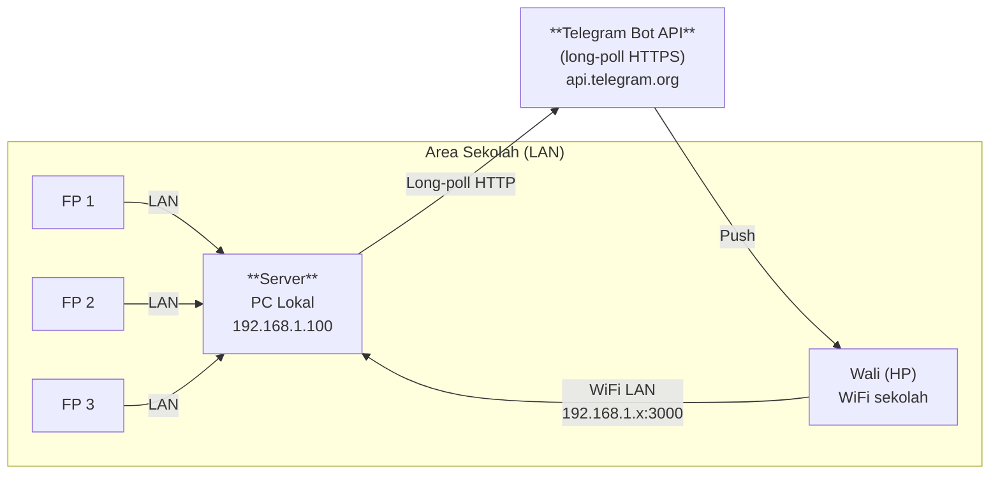
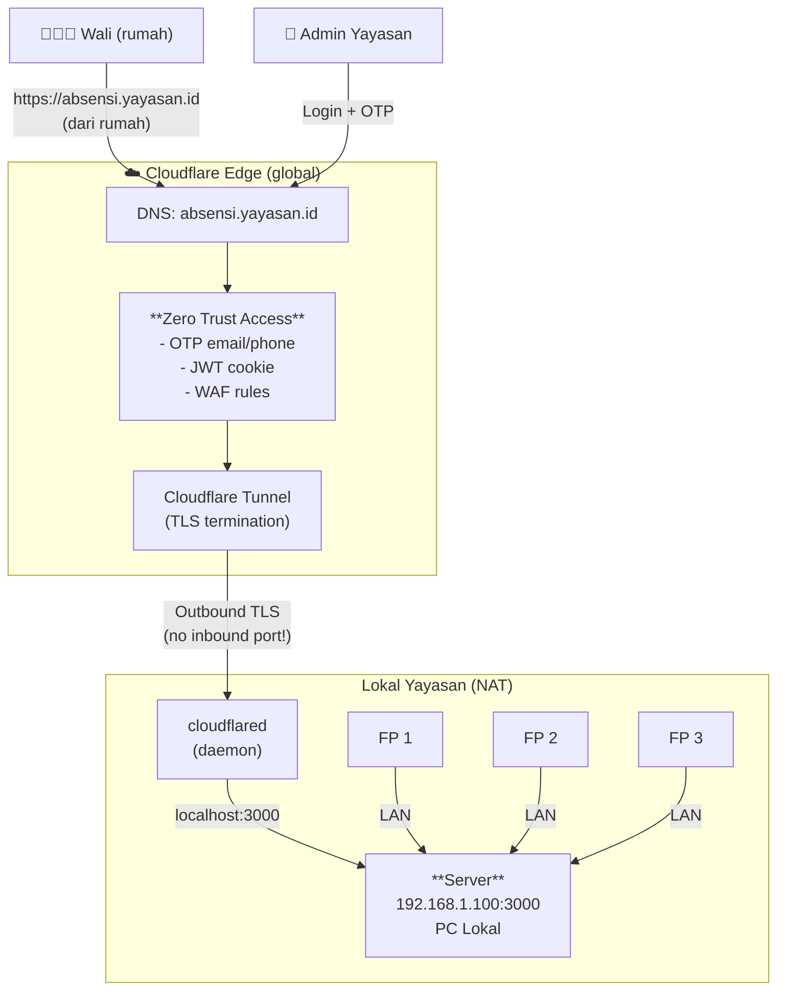
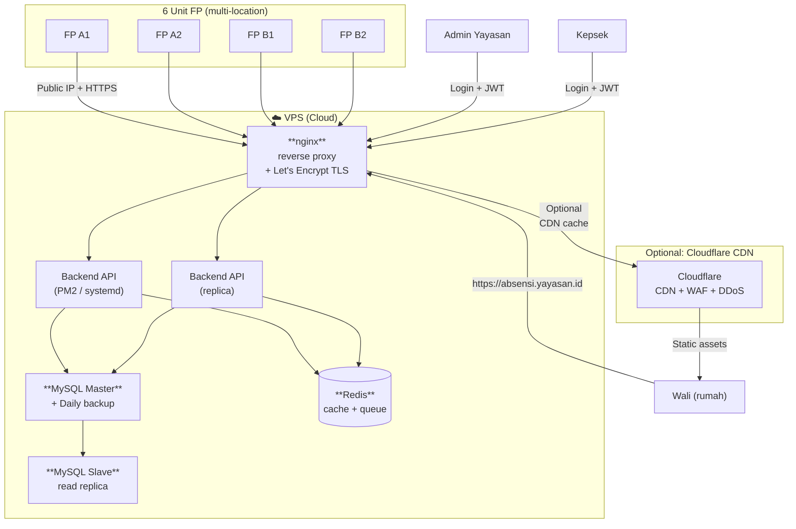
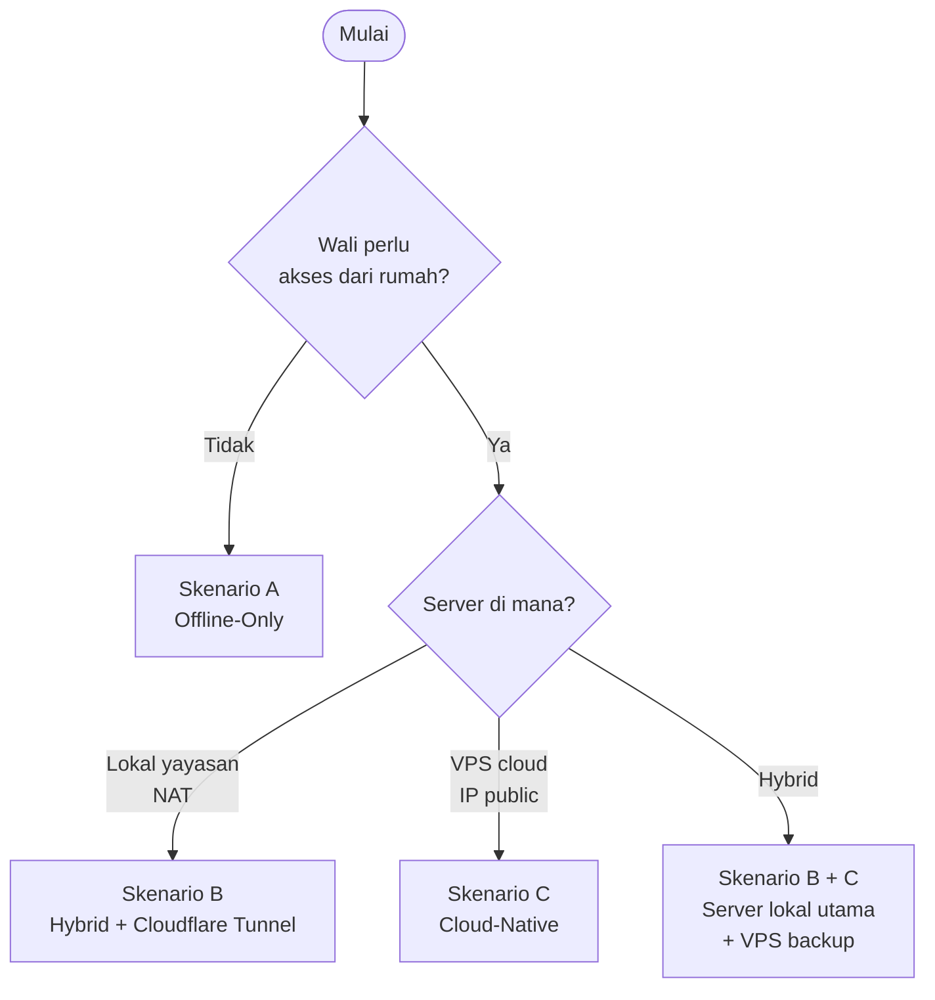

# 🌐 Server & Network: 3 Deployment Scenarios + Zero Trust

> **Reusable blueprint** untuk semua project self-hosted. 3 skenario dari paling sederhana (offline) sampai paling scalable (cloud-native). Plus **Cloudflare Zero Trust** sebagai opsi ketika server NAT-only (no public IP).

## 🎯 Pertanyaan Kunci Sebelum Pilih Skenario

| # | Pertanyaan | Jawaban menentukan |
|---|------------|-------------------|
| 1 | Server ada di mana? | **(A) lokal yayasan** (PC di sekolah, NAT-only) / **(B) VPS cloud** (IDCloudHost, DO, Vultr) / **(C) on-prem + cloud hybrid** |
| 2 | Punya IP public? | **Ya** (static, dedicated) / **Tidak** (NAT, di belakang router sekolah) / **Tidak perlu** (semua akses via VPN/tunnel) |
| 3 | User akses dari mana? | **Hanya internal** (WiFi sekolah) / **External (wali dari rumah)** / **Multi-cabang** |
| 4 | Butuh HTTPS? | **Wajib** untuk wali eksternal, opsional untuk internal |
| 5 | Budget运维 (maintenance)? | **Sendiri** (1 admin) / **Vendor** (pihak ketiga handle) |
| 6 | Risiko jika server down? | **Tinggi** (wali harus tahu cepat) / **Sedang** (bisa info manual) |

## 🏗️ 3 Skenario Deployment

---

### 🟢 Skenario A: **Offline-Only (Lokal Yayasan, NAT, No Public IP)**

**Cocok untuk:** pesantren kecil, wali hanya di area sekolah via WiFi pesantren, atau kalau wali/info cukup lewat Telegram bot tanpa perlu akses web

**Topologi:**
```
[6 FP] --LAN--> [Server Lokal] <--WiFi pesantren-- [HP Wali di area sekolah]
                  (PC Windows/Linux)
```

**Konfigurasi jaringan:**
- Server di NAT belakang router sekolah (192.168.1.x)
- Tidak ada IP public
- Wali akses web/Sheets **hanya** kalau di area pesantren
- Telegram bot jalan pakai polling mode (gak butuh HTTPS, pakai long-poll HTTP)
- Fingerprint device pakai static IP di LAN (192.168.1.10-15)

**Diagram:**


**Stack minimum:**
- Server: PC Windows/Linux di ruang tata usaha
- OS: Windows 10 + WSL2 / Ubuntu Server 22.04
- DB: SQLite (gak perlu MySQL server) atau MySQL lokal
- Backend: Node + Express, port 3000 (HTTP only, internal)
- Telegram: polling mode (no HTTPS, no domain)
- Backup: USB drive + sync ke Google Drive manual

**Pro:**
- ✅ Sangat murah (PC lokal, no VPS)
- ✅ Gak perlu setup jaringan
- ✅ Gak ada risiko exposed ke internet
- ✅ Full kontrol data (tidak keluar sekolah)

**Kontra:**
- ❌ Wali **tidak bisa akses dari rumah** (harus di WiFi sekolah)
- ❌ Server mati = tidak ada notif (no cloud backup)
- ❌ Gak scalable (kalau 1 server rusak, mati)
- ❌ Maintenance manual (backup USB, restart kalau hang)

**Cloudflare Tunnel (opsional):**
- **TIDAK PERLU** kalau wali tidak akses dari rumah
- **Bisa dipakai** kalau nanti wali butuh akses remote, tinggal tambah `cloudflared` di server lokal → expose ke internet via tunnel, **tanpa buka port** di router

**Cocok untuk:** Konsep 1-2 (Mini Telegram, no web)

---

### 🟡 Skenario B: **Hybrid (Server Lokal + Cloudflare Tunnel Zero Trust)**

**Cocok untuk:** pesantren yang punya PC server tapi **tidak punya IP public** (atau males setup port forwarding), wali akses dari rumah

**Konfigurasi jaringan:**
- Server lokal di NAT (192.168.1.x) — sama dengan Skenario A
- Install `cloudflared` daemon di server lokal
- Cloudflare Tunnel → buat **outbound-only connection** ke Cloudflare edge
- Cloudflare kasih **public hostname** (mis. `absensi.yayasan.id`)
- Wali akses `https://absensi.yayasan.id` → traffic lewat Cloudflare edge → tunnel → server lokal
- **Zero Trust policy**: wali login via OTP email/OTP Telegram, daput session cookie

**Diagram:**


**Setup steps (Cloudflare Zero Trust):**
1. Daftar Cloudflare (free tier cukup untuk pesantren)
2. Tambah domain `yayasan.id` ke Cloudflare (atau beli subdomain)
3. Dashboard → Zero Trust → Access → Applications → Add
4. Application type: `Self-hosted`
5. Domain: `absensi.yayasan.id`
6. Policy: `Email` atau `OTP` (one-time password)
7. Install `cloudflared` di server lokal:
   ```bash
   # Linux
   curl -L https://github.com/cloudflare/cloudflared/releases/latest/download/cloudflared-linux-amd64.deb -o cloudflared.deb
   sudo dpkg -i cloudflared.deb
   cloudflared service install <token>
   ```
8. Jalankan sebagai service (auto-start saat boot)

**Stack:**
- Server: PC lokal + cloudflared daemon
- DB: MySQL lokal (bisa juga cloud MySQL via tunnel)
- Backend: Node + Express di localhost:3000
- Public access: via `https://absensi.yayasan.id`
- Auth: Cloudflare Access (OTP, no need build login page)

**Pro:**
- ✅ Wali akses dari rumah, **aman** (Zero Trust)
- ✅ Server lokal (data tidak keluar, full kontrol)
- ✅ Gak perlu port forwarding di router sekolah
- ✅ Cloudflare handle DDoS, WAF, TLS otomatis
- ✅ Free tier Cloudflare Zero Trust: **50 users gratis** (cukup untuk wali + admin)
- ✅ IP sekolah tidak exposed (zero attack surface)

**Kontra:**
- ❌ Butuh domain (Rp 200rb/tahun) + setup Cloudflare
- ❌ Tergantung koneksi internet lokal (kalau putus, wali tidak bisa akses)
- ❌ Server lokal masih single point of failure
- ❌ Setup cloudflared perlu learning curve (~30 menit)

**Cloudflare Zero Trust Features (free tier):**
- ✅ 50 user
- ✅ OTP authentication
- ✅ JWT session (cookie)
- ✅ WAF rules (block SQL injection, dll)
- ✅ Rate limiting (60 req/menit per IP)
- ✅ Analytics: siapa akses dari mana, berapa kali
- ❌ Tidak ada: Access Groups advanced, Device posture (harus bayar)

**Cocok untuk:** Konsep 2-4 (Mini Telegram, Lite Web, Standard)

---

### 🔵 Skenario C: **Cloud-Native (VPS + Public IP + Managed Security)**

**Cocok untuk:** multi-cabang, 1000+ user, butuh SLA tinggi, ada tim DevOps

**Konfigurasi jaringan:**
- Server di cloud VPS (IDCloudHost, DigitalOcean, Vultr, AWS, GCP)
- VPS punya **public IP** (statik, dedicated)
- TLS via Let's Encrypt (certbot + nginx reverse proxy)
- Cloudflare sebagai additional layer (CDN, WAF, caching) — opsional
- DB managed (RDS / DigitalOcean Managed MySQL) atau self-managed
- Redis managed untuk cache/queue
- Backup managed (snapshot harian)

**Diagram:**


**Stack:**
- VPS: 2-4 vCPU, 4-8 GB RAM (~$20-40/bulan)
- OS: Ubuntu 22.04 LTS
- Reverse proxy: nginx + Let's Encrypt (certbot)
- Backend: Node + NestJS, PM2 untuk process management
- DB: MySQL 8.4 (master + read replica)
- Cache: Redis 7
- Monitoring: UptimeRobot (free) + Sentry (error tracking)
- Backup: Snapshot harian + offsite S3

**Pro:**
- ✅ Scalable (vertical & horizontal)
- ✅ 99.9% uptime SLA dari cloud provider
- ✅ Data center redundancy (kalau pilih multi-region)
- ✅ Geo-distributed (edge response lebih cepat)
- ✅ Managed DB = auto backup, point-in-time recovery

**Kontra:**
- ❌ Biaya lebih tinggi (Rp 300-500rb/bulan)
- ❌ Butuh skill DevOps (linux, nginx, MySQL tuning)
- ❌ Data keluar dari yurisdiksi lokal (privacy concern)
- ❌ Koneksi internet lokal pesantren harus reliable (kalau putus, FP tidak bisa kirim ke server)
- ❌ Compliance (kalau pesantren punya aturan data harus di Indonesia, perlu pilih VPS lokal)

**Cocok untuk:** Konsep 5-7 (Pro Multi-Sekolah, Enterprise, Premium)

---

## 🔐 Cloudflare Zero Trust — Deep Dive (Skenario B)

Karena Skenario B paling umum untuk pesantren Indonesia, ini detail lebih:

### Mengapa Cloudflare Tunnel > Port Forwarding Tradisional

| Aspek | Port Forwarding | Cloudflare Tunnel |
|-------|----------------|-------------------|
| Buka port di router | ✅ Ya (80, 443) | ❌ **Tidak perlu** |
| IP sekolah exposed | ✅ Ya (raw IP bisa di-scan) | ❌ **Tidak** (cuma outbound 443 ke CF) |
| DDoS protection | ❌ Tidak | ✅ Ya (Cloudflare handle) |
| TLS termination | Manual (Let's Encrypt) | ✅ Otomatis (CF edge) |
| Auth layer | Build sendiri | ✅ Cloudflare Access (OTP) |
| Audit log | Sendiri | ✅ Built-in (siapa akses kapan) |
| Setup time | 2-4 jam | 30 menit |
| Biaya | Gratis | Gratis (50 user) |

### Setup Flow (Step-by-Step)

```bash
# 1. Install cloudflared di server lokal
curl -fsSL https://pkg.cloudflare.com/cloudflare-main.gpg | sudo tee /usr/share/keyrings/cloudflare-main.gpg >/dev/null
echo 'deb [signed-by=/usr/share/keyrings/cloudflare-main.gpg] https://pkg.cloudflare.com/cloudflared focal main' | sudo tee /etc/apt/sources.list.d/cloudflared.list
sudo apt update && sudo apt install cloudflared

# 2. Login (buka link di output, authorize domain)
cloudflared tunnel login

# 3. Buat tunnel
cloudflared tunnel create absensi-tunnel
# Output: Created tunnel absensi-tunnel with id: <UUID>

# 4. Config DNS route
cloudflared tunnel route dns absensi-tunnel absensi.yayasan.id

# 5. Config file
cat > /etc/cloudflared/config.yml <<EOF
tunnel: <UUID>
credentials-file: /etc/cloudflared/.cert.json

ingress:
  - hostname: absensi.yayasan.id
    service: http://localhost:3000
  - service: http_status:404
EOF

# 6. Install sebagai service (auto-start)
sudo cloudflared service install
sudo systemctl enable cloudflared
sudo systemctl start cloudflared

# 7. Test
curl https://absensi.yayasan.id
```

### Cloudflare Access Policy (Auth)

Di dashboard Cloudflare:
1. **Zero Trust → Access → Applications → Add Application**
2. Type: **Self-hosted**
3. Name: `Absensi Fingerprint`
4. Domain: `absensi.yayasan.id`
5. **Policy:**
   - Name: `Wali & Admin`
   - Action: **Allow**
   - Include:
     - Emails: `*@yayasan.id` (semua staff)
     - Email list: `wali-terdaftar@yayasan.id`
   - **Session duration:** 24 hours
6. **Identity providers:** aktifkan OTP via email (default)

User flow saat akses:
```
1. Buka https://absensi.yayasan.id
2. Cloudflare Access: "Masukkan email"
3. Submit → email OTP
4. Submit OTP → daput JWT cookie (24 jam)
5. Reverse proxy: traffic lewat ke server lokal
6. Backend: validate JWT (optional, trust CF header)
```

### Hardening (Optional tapi Recommended)

```yaml
# /etc/cloudflared/config.yml — production
tunnel: <UUID>
credentials-file: /etc/cloudflared/.cert.json

# Logging
logfile: /var/log/cloudflared.log
loglevel: info

# Metrics + Prometheus
metrics: localhost:2000

# Performance
retries: 5
grace-period: 30s
```

---

## 📊 Decision Matrix: Pilih Skenario

| Kebutuhan | Skenario A | Skenario B | Skenario C |
|-----------|:---:|:---:|:---:|
| **Wali tidak perlu akses dari rumah** | ⭐⭐⭐ | ⭐⭐ | ⭐ |
| **Wali akses dari rumah (penting)** | ❌ | ⭐⭐⭐ | ⭐⭐⭐ |
| **Server di lokal yayasan (data sovereignty)** | ⭐⭐⭐ | ⭐⭐⭐ | ⭐ |
| **Server di cloud (scalable)** | ❌ | ⭐ | ⭐⭐⭐ |
| **Setup cepat (< 1 hari)** | ⭐⭐⭐ | ⭐⭐ | ⭐ |
| **Biaya sangat murah (< Rp 100rb/bln)** | ⭐⭐⭐ | ⭐⭐⭐ | ⭐ |
| **High availability (99.9% SLA)** | ❌ | ⭐ | ⭐⭐⭐ |
| **Zero Trust security** | ⭐ | ⭐⭐⭐ | ⭐⭐ |
| **Butuh IP public** | ❌ | ❌ | ✅ |
| **Cocok multi-cabang** | ❌ | ⭐ | ⭐⭐⭐ |

### Flowchart Pemilihan



---

## 💡 Rekomendasi untuk ABSENSI Fingerprint Pesantren

| Konsep Sistem | Skenario Server |
|---------------|-----------------|
| Konsep 1 (WA) | **A** (offline, Telegram polling) |
| Konsep 2 (Telegram) | **B** (kalau wali dari rumah) atau **A** (kalau cukup di sekolah) |
| Konsep 3 (Lite Web) | **B** (Cloudflare Tunnel, hemat + aman) |
| Konsep 4 (Standard) | **B** atau **C** (tergantung budget & skill) |
| Konsep 5 (Multi-Sekolah) | **C** (WAJIB cloud, multi-region) |
| Konsep 6 (Enterprise) | **C** (managed everything) |
| Konsep 7 (Premium) | **C** + **Multi-cloud** (AWS + GCP, active-active) |

## 🛡️ Security Hardening (All Scenarios)

Walau sudah ada Zero Trust di Skenario B/C, tetap perlu hardening di server:

```bash
# 1. Firewall (hanya buka port yg perlu)
sudo ufw default deny incoming
sudo ufw allow ssh
sudo ufw allow 3000  # only if no tunnel
sudo ufw enable

# 2. SSH key-only login
sudo nano /etc/ssh/sshd_config
# PasswordAuthentication no
sudo systemctl restart sshd

# 3. Auto security updates
sudo apt install unattended-upgrades
sudo dpkg-reconfigure -plow unattended-upgrades

# 4. Fail2ban (block brute force)
sudo apt install fail2ban
sudo systemctl enable fail2ban

# 5. Backup harian
0 3 * * * /usr/bin/mysqldump absensi | gzip > /var/backups/absensi-$(date +\%F).sql.gz
# Sync ke cloud: rclone sync /var/backups/ remote:absensi-backup
```

## 📚 Resource Links

- Cloudflare Tunnel docs: https://developers.cloudflare.com/cloudflare-one/connections/connect-networks/
- Cloudflare Zero Trust (free 50 user): https://www.cloudflare.com/products/zero-trust/
- Let's Encrypt: https://letsencrypt.org/
- nginx reverse proxy guide: https://docs.nginx.com/nginx/admin-guide/web-server/reverse-proxy/
- Tailscale Funnel (alternatif): https://tailscale.com/kb/1223/funnel/
- ngrok (alternatif, ada free tier): https://ngrok.com/

## 🔗 See Also

- `04-MULTI-CONCEPT-7-SCHEMAS.md` — 7 konsep sistem
- `02-SYSTEM-DIAGRAMS.md` — Diagram engineering detail
- `03-NO-WEB-SOLUTION.md` — Telegram-only (Skenario A)
- `60-Blueprints/HERMES_TUNING.md` — Anti-halusinasi config
- `60-Blueprints/ORCHESTRATION.md` — Multi-agent orchestration
