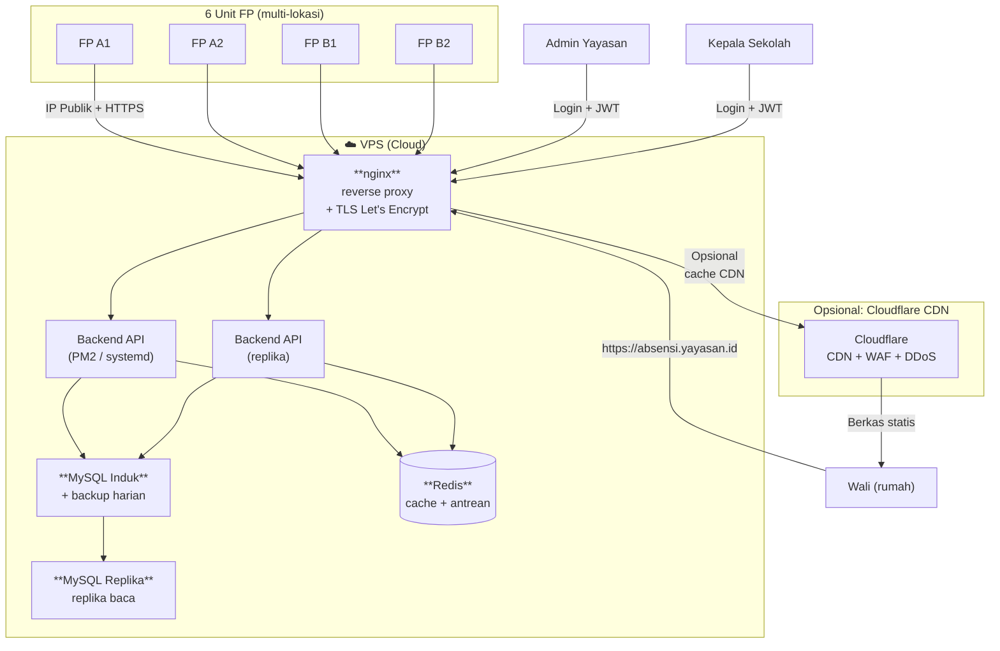

# 🌐 Server & Jaringan: 3 Skenario Deployment + Zero Trust

> **Cetak biru reusable** untuk semua proyek self-hosted. 3 skenario dari paling sederhana (offline) sampai paling scalable (cloud-native). Plus **Cloudflare Zero Trust** sebagai opsi ketika server NAT-only (tanpa IP publik).

## 🎯 Pertanyaan Kunci Sebelum Pilih Skenario

| # | Pertanyaan | Jawaban menentukan |
|---|------------|-------------------|
| 1 | Server ada di mana? | **(A) lokal yayasan** (PC di sekolah, NAT) / **(B) VPS cloud** (IDCloudHost, DO, Vultr) / **(C) on-prem + cloud hybrid** |
| 2 | Punya IP publik? | **Ya** (statik, dedicated) / **Tidak** (NAT, di belakang router sekolah) / **Tidak perlu** (semua akses via VPN/tunnel) |
| 3 | Pengguna akses dari mana? | **Hanya internal** (WiFi sekolah) / **Eksternal (wali dari rumah)** / **Multi-cabang** |
| 4 | Butuh HTTPS? | **Wajib** untuk wali eksternal, opsional untuk internal |
| 5 | Bujet pemeliharaan? | **Sendiri** (1 admin) / **Vendor** (pihak ketiga urus) |
| 6 | Risiko jika server mati? | **Tinggi** (wali harus tahu cepat) / **Sedang** (bisa info manual) |

## 🏗️ 3 Skenario Deployment

---

### 🟢 Skenario A: **Offline-Only (Lokal Yayasan, NAT, Tanpa IP Publik)**

**Cocok untuk:** pesantren kecil, wali hanya di area sekolah via WiFi pesantren, atau cukup lewat Telegram bot tanpa akses web.

**Topologi:**
```
[6 FP] --LAN--> [Server Lokal] <--WiFi pesantren-- [HP Wali di area sekolah]
                  (PC Windows/Linux)
```

**Konfigurasi jaringan:**
- Server di NAT belakang router sekolah (192.168.1.x)
- Tidak ada IP publik
- Wali akses web/Sheets **hanya** kalau di area pesantren
- Bot Telegram jalan pakai mode polling (tanpa HTTPS, pakai long-poll HTTP)
- Perangkat fingerprint pakai IP statik di LAN (192.168.1.10–15)

**Diagram:**


**Stack minimum:**
- Server: PC Windows/Linux di ruang tata usaha
- OS: Windows 10 + WSL2 / Ubuntu Server 22.04
- Basis data: SQLite (tanpa MySQL server) atau MySQL lokal
- Backend: Node + Express, port 3000 (HTTP saja, internal)
- Telegram: mode polling (tanpa HTTPS, tanpa domain)
- Backup: USB drive + sinkron ke Google Drive manual

**Kelebihan:**
- ✅ Sangat murah (PC lokal, tanpa VPS)
- ✅ Tanpa setup jaringan rumit
- ✅ Tanpa risiko terbuka ke internet
- ✅ Kendali penuh data (tidak keluar sekolah)

**Kekurangan:**
- ❌ Wali **tidak bisa akses dari rumah** (harus di WiFi sekolah)
- ❌ Server mati = tidak ada notif (tanpa backup cloud)
- ❌ Tidak scalable (kalau 1 server rusak, mati total)
- ❌ Pemeliharaan manual (backup USB, restart kalau hang)

**Cloudflare Tunnel (opsional):**
- **TIDAK PERLU** kalau wali tidak akses dari rumah
- **Bisa dipakai** kalau nanti wali butuh akses remote — tinggal tambah `cloudflared` di server lokal → buka ke internet via tunnel

**Cocok untuk:** Konsep 1–2 (Minimalis WhatsApp, Minimalis Telegram)

---

### 🟡 Skenario B: **Hybrid (Server Lokal + Cloudflare Tunnel Zero Trust)**

**Cocok untuk:** pesantren yang punya PC server tapi **tidak punya IP publik** (atau males setup port forwarding), wali akses dari rumah.

**Konfigurasi jaringan:**
- Server lokal di NAT (192.168.1.x) — sama dengan Skenario A
- Install `cloudflared` daemon di server lokal
- Cloudflare Tunnel → buat **koneksi outbound-only** ke Cloudflare edge
- Cloudflare kasih **public hostname** (misal `absensi.yayasan.id`)
- Wali akses `https://absensi.yayasan.id` → trafik lewat Cloudflare edge → tunnel → server lokal
- **Kebijakan Zero Trust**: wali login via OTP email/OTP Telegram, dapat session cookie

**Diagram:**


**Langkah setup (Cloudflare Zero Trust):**
1. Daftar Cloudflare (paket gratis cukup untuk pesantren)
2. Tambah domain `yayasan.id` ke Cloudflare (atau beli subdomain)
3. Dasbor → Zero Trust → Access → Applications → Add
4. Jenis aplikasi: `Self-hosted`
5. Domain: `absensi.yayasan.id`
6. Kebijakan: `Email` atau `OTP` (sandi sekali pakai)
7. Install `cloudflared` di server lokal:
   ```bash
   # Linux
   curl -L https://github.com/cloudflare/cloudflared/releases/latest/download/cloudflared-linux-amd64.deb -o cloudflared.deb
   sudo dpkg -i cloudflared.deb
   cloudflared service install <token>
   ```
8. Jalankan sebagai layanan (auto-start saat boot)

**Stack:**
- Server: PC lokal + daemon cloudflared
- Basis data: MySQL lokal (bisa juga cloud MySQL via tunnel)
- Backend: Node + Express di localhost:3000
- Akses publik: via `https://absensi.yayasan.id`
- Autentikasi: Cloudflare Access (OTP, tidak perlu bikin halaman login)

**Kelebihan:**
- ✅ Wali akses dari rumah, **aman** (Zero Trust)
- ✅ Server lokal (data tidak keluar, kendali penuh)
- ✅ Tanpa port forwarding di router sekolah
- ✅ Cloudflare urus DDoS, WAF, TLS otomatis
- ✅ Paket gratis Cloudflare Zero Trust: **50 pengguna gratis** (cukup untuk wali + admin)
- ✅ IP sekolah tidak terbuka (permukaan serangan nol)

**Kekurangan:**
- ❌ Butuh domain (Rp 200 ribu/tahun) + setup Cloudflare
- ❌ Tergantung koneksi internet lokal (kalau putus, wali tidak bisa akses)
- ❌ Server lokal masih titik kegagalan tunggal
- ❌ Setup cloudflared perlu waktu belajar (~30 menit)

**Fitur Cloudflare Zero Trust (paket gratis):**
- ✅ 50 pengguna
- ✅ Autentikasi OTP
- ✅ Sesi JWT (cookie)
- ✅ Aturan WAF (blokir SQL injection, dll)
- ✅ Pembatasan laju (60 permintaan/menit per IP)
- ✅ Analitik: siapa akses dari mana, berapa kali
- ❌ Tidak ada: Access Groups lanjutan, Device posture (harus bayar)

**Cocok untuk:** Konsep 2–4 (Minimalis Telegram, Ringan Web, Standar)

---

### 🔵 Skenario C: **Cloud-Native (VPS + IP Publik + Keamanan Terkelola)**

**Cocok untuk:** multi-cabang, 1.000+ pengguna, butuh SLA tinggi, ada tim DevOps.

**Konfigurasi jaringan:**
- Server di cloud VPS (IDCloudHost, DigitalOcean, Vultr, AWS, GCP)
- VPS punya **IP publik** (statik, dedicated)
- TLS via Let's Encrypt (certbot + nginx reverse proxy)
- Cloudflare sebagai lapisan tambahan (CDN, WAF, caching) — opsional
- Basis data terkelola (RDS / DigitalOcean Managed MySQL) atau kelola sendiri
- Redis terkelola untuk cache/antrean
- Backup terkelola (snapshot harian)

**Diagram:**


**Stack:**
- VPS: 2–4 vCPU, 4–8 GB RAM (~Rp 350–700 ribu/bulan)
- OS: Ubuntu 22.04 LTS
- Reverse proxy: nginx + Let's Encrypt (certbot)
- Backend: Node + NestJS, PM2 untuk manajemen proses
- Basis data: MySQL 8.4 (induk + replika baca)
- Cache: Redis 7
- Pemantauan: UptimeRobot (gratis) + Sentry (pelacakan error)
- Backup: Snapshot harian + offsite S3

**Kelebihan:**
- ✅ Scalable (vertikal & horizontal)
- ✅ SLA uptime 99,9% dari penyedia cloud
- ✅ Redundansi pusat data (kalau pilih multi-region)
- ✅ Tersebar geografis (respons edge lebih cepat)
- ✅ Basis data terkelola = backup otomatis, pemulihan point-in-time

**Kekurangan:**
- ❌ Biaya lebih tinggi (Rp 300–500 ribu/bulan)
- ❌ Butuh keahlian DevOps (Linux, nginx, tuning MySQL)
- ❌ Data keluar dari yurisdiksi lokal (isu privasi)
- ❌ Koneksi internet lokal pesantren harus andal (kalau putus, FP tidak bisa kirim ke server)
- ❌ Kepatuhan (kalau pesantren punya aturan data harus di Indonesia, perlu pilih VPS lokal)

**Cocok untuk:** proyek multi-cabang besar (di luar lingkup 4 konsep di dokumen ini)

---

## 🔐 Cloudflare Zero Trust — Detail Mendalam (Skenario B)

Karena Skenario B paling umum untuk pesantren Indonesia, ini detailnya:

### Mengapa Cloudflare Tunnel > Port Forwarding Tradisional

| Aspek | Port Forwarding | Cloudflare Tunnel |
|-------|----------------|-------------------|
| Buka port di router | ✅ Ya (80, 443) | ❌ **Tidak perlu** |
| IP sekolah terbuka | ✅ Ya (IP mentah bisa di-scan) | ❌ **Tidak** (hanya keluar 443 ke CF) |
| Perlindungan DDoS | ❌ Tidak | ✅ Ya (Cloudflare urus) |
| Terminasi TLS | Manual (Let's Encrypt) | ✅ Otomatis (CF edge) |
| Lapisan autentikasi | Bangun sendiri | ✅ Cloudflare Access (OTP) |
| Log audit | Sendiri | ✅ Bawaan (siapa akses kapan) |
| Waktu setup | 2–4 jam | 30 menit |
| Biaya | Gratis | Gratis (50 pengguna) |

### Alur Setup (Langkah demi Langkah)

```bash
# 1. Install cloudflared di server lokal
curl -fsSL https://pkg.cloudflare.com/cloudflare-main.gpg | sudo tee /usr/share/keyrings/cloudflare-main.gpg >/dev/null
echo 'deb [signed-by=/usr/share/keyrings/cloudflare-main.gpg] https://pkg.cloudflare.com/cloudflared focal main' | sudo tee /etc/apt/sources.list.d/cloudflared.list
sudo apt update && sudo apt install cloudflared

# 2. Login (buka tautan di output, otorisasi domain)
cloudflared tunnel login

# 3. Buat tunnel
cloudflared tunnel create absensi-tunnel
# Output: Created tunnel absensi-tunnel with id: <UUID>

# 4. Atur rute DNS
cloudflared tunnel route dns absensi-tunnel absensi.yayasan.id

# 5. Berkas konfigurasi
cat > /etc/cloudflared/config.yml <<EOF
tunnel: <UUID>
credentials-file: /etc/cloudflared/.cert.json

ingress:
  - hostname: absensi.yayasan.id
    service: http://localhost:3000
  - service: http_status:404
EOF

# 6. Install sebagai layanan (auto-start)
sudo cloudflared service install
sudo systemctl enable cloudflared
sudo systemctl start cloudflared

# 7. Uji
curl https://absensi.yayasan.id
```

### Kebijakan Cloudflare Access (Autentikasi)

Di dasbor Cloudflare:
1. **Zero Trust → Access → Applications → Add Application**
2. Jenis: **Self-hosted**
3. Nama: `Absensi Fingerprint`
4. Domain: `absensi.yayasan.id`
5. **Kebijakan:**
   - Nama: `Wali & Admin`
   - Aksi: **Allow**
   - Sertakan:
     - Email: `*@yayasan.id` (semua staf)
     - Daftar email: `wali-terdaftar@yayasan.id`
   - **Durasi sesi:** 24 jam
6. **Penyedia identitas:** aktifkan OTP via email (bawaan)

Alur pengguna saat akses:
```
1. Buka https://absensi.yayasan.id
2. Cloudflare Access: "Masukkan email"
3. Kirim → email OTP
4. Kirim OTP → dapat cookie JWT (24 jam)
5. Reverse proxy: trafik lewat ke server lokal
6. Backend: validasi JWT (opsional, percaya header CF)
```

### Hardening (Opsional tapi Disarankan)

```yaml
# /etc/cloudflared/config.yml — produksi
tunnel: <UUID>
credentials-file: /etc/cloudflared/.cert.json

# Logging
logfile: /var/log/cloudflared.log
loglevel: info

# Metrik + Prometheus
metrics: localhost:2000

# Performa
retries: 5
grace-period: 30s
```

---

## 📊 Matriks Keputusan: Pilih Skenario

| Kebutuhan | Skenario A | Skenario B | Skenario C |
|-----------|:---:|:---:|:---:|
| **Wali tidak perlu akses dari rumah** | ⭐⭐⭐ | ⭐⭐ | ⭐ |
| **Wali akses dari rumah (penting)** | ❌ | ⭐⭐⭐ | ⭐⭐⭐ |
| **Server di lokal yayasan (kedaulatan data)** | ⭐⭐⭐ | ⭐⭐⭐ | ⭐ |
| **Server di cloud (scalable)** | ❌ | ⭐ | ⭐⭐⭐ |
| **Setup cepat (< 1 hari)** | ⭐⭐⭐ | ⭐⭐ | ⭐ |
| **Biaya sangat murah (< Rp 100 ribu/bln)** | ⭐⭐⭐ | ⭐⭐⭐ | ⭐ |
| **Ketersediaan tinggi (SLA 99,9%)** | ❌ | ⭐ | ⭐⭐⭐ |
| **Keamanan Zero Trust** | ⭐ | ⭐⭐⭐ | ⭐⭐ |
| **Butuh IP publik** | ❌ | ❌ | ✅ |
| **Cocok multi-cabang** | ❌ | ⭐ | ⭐⭐⭐ |

### Bagan Alir Pemilihan


---

## 💡 Rekomendasi untuk Absensi Fingerprint Pesantren

| Konsep Sistem | Skenario Server |
|---------------|-----------------|
| Konsep 1 (WhatsApp) | **A** (offline, polling WhatsApp) |
| Konsep 2 (Telegram) | **B** (kalau wali dari rumah) atau **A** (kalau cukup di sekolah) |
| Konsep 3 (Ringan Web) | **B** (Cloudflare Tunnel, hemat + aman) |
| Konsep 4 (Standar) | **B** atau **C** (tergantung bujet & keahlian) |

## 🛡️ Hardening Keamanan (Semua Skenario)

Walau sudah ada Zero Trust di Skenario B/C, tetap perlu hardening di server:

```bash
# 1. Firewall (hanya buka port yang perlu)
sudo ufw default deny incoming
sudo ufw allow ssh
sudo ufw allow 3000  # hanya kalau tanpa tunnel
sudo ufw enable

# 2. SSH hanya pakai kunci
sudo nano /etc/ssh/sshd_config
# PasswordAuthentication no
sudo systemctl restart sshd

# 3. Pembaruan keamanan otomatis
sudo apt install unattended-upgrades
sudo dpkg-reconfigure -plow unattended-upgrades

# 4. Fail2ban (blokir brute force)
sudo apt install fail2ban
sudo systemctl enable fail2ban

# 5. Backup harian
0 3 * * * /usr/bin/mysqldump absensi | gzip > /var/backups/absensi-$(date +\%F).sql.gz
# Sinkron ke cloud: rclone sync /var/backups/ remote:absensi-backup
```

## 📚 Tautan Referensi

- Dokumentasi Cloudflare Tunnel: https://developers.cloudflare.com/cloudflare-one/connections/connect-networks/
- Cloudflare Zero Trust (gratis 50 pengguna): https://www.cloudflare.com/products/zero-trust/
- Let's Encrypt: https://letsencrypt.org/
- Panduan nginx reverse proxy: https://docs.nginx.com/nginx/admin-guide/web-server/reverse-proxy/
- Tailscale Funnel (alternatif): https://tailscale.com/kb/1223/funnel/
- ngrok (alternatif, ada paket gratis): https://ngrok.com/

## 🔗 Lihat Juga

- `04-MULTI-CONCEPT-4-SCHEMAS.md` — 4 konsep sistem
- `02-SYSTEM-DIAGRAMS.md` — Diagram detail teknis
- `03-NO-WEB-SOLUTION.md` — Hanya Telegram (Skenario A)
- `60-Blueprints/HERMES_TUNING.md` — Konfigurasi anti-halusinasi
- `60-Blueprints/ORCHESTRATION.md` — Orkestrasi multi-agent
