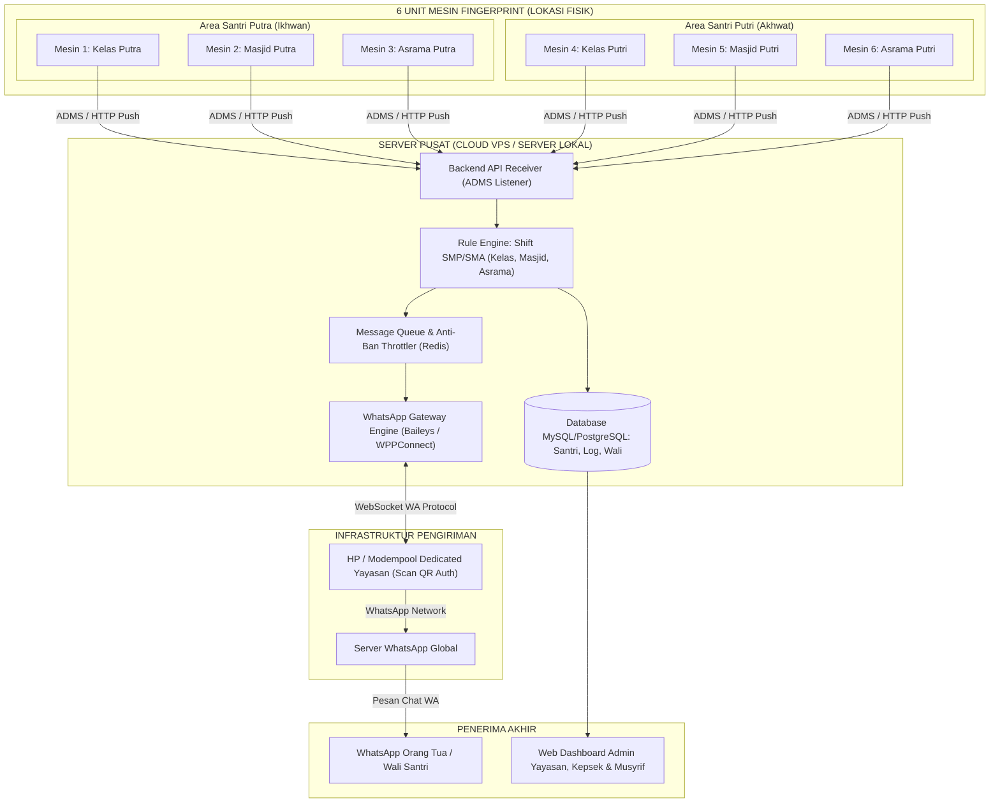
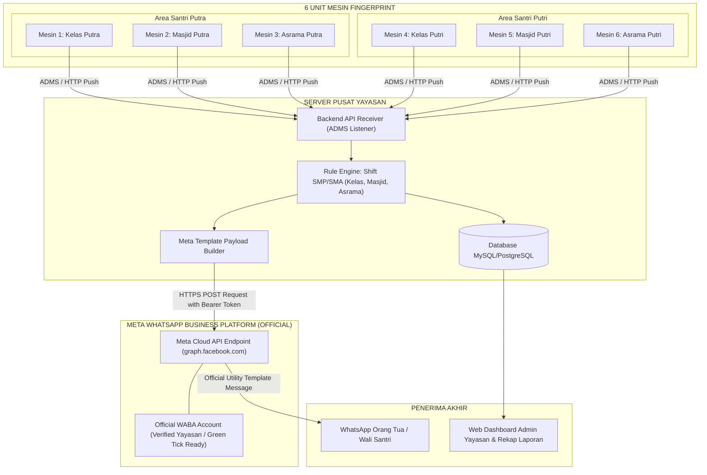
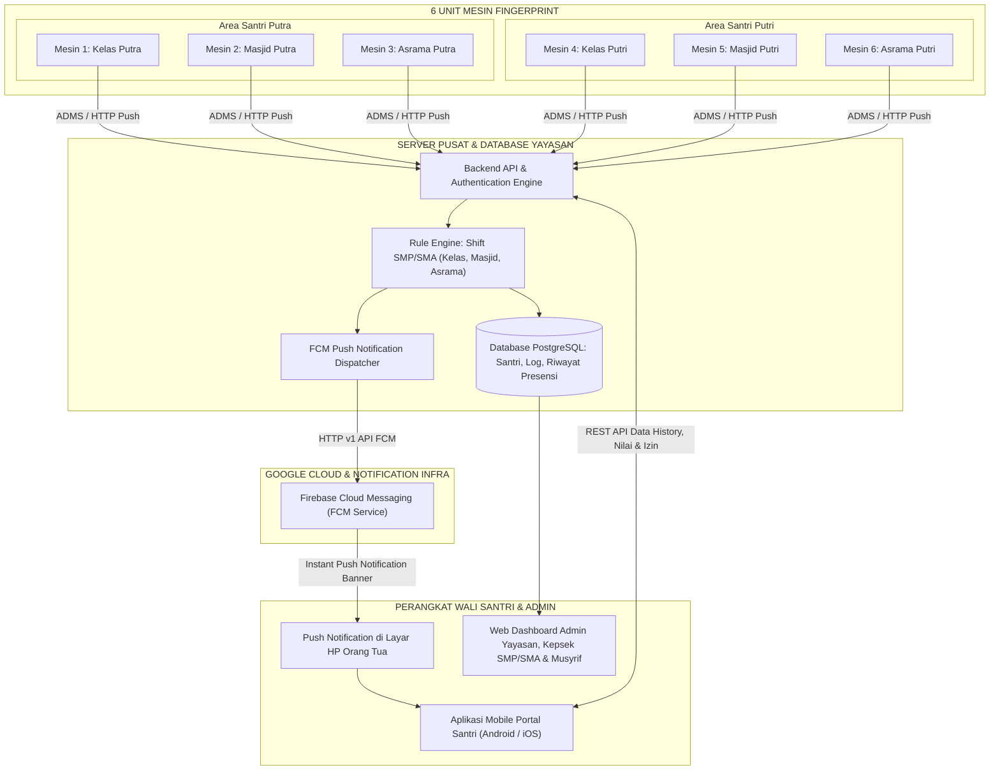

# DOKUMEN ARSITEKTUR SISTEM & MASTERPLAN
## 3 SKEMA LENGKAP SISTEM ABSENSI FINGERPRINT PESANTREN (SMP & SMA)
**Yayasan Pendidikan & Pondok Pesantren — 6 Mesin Fingerprint**

Dokumen ini membedah **3 Skema Arsitektur Sistem yang Berdiri Sendiri (Masing-Masing Terpisah Secara Penuh)** agar pihak yayasan dapat memilih opsi yang paling sesuai dengan anggaran, infrastruktur, dan kebutuhan operasional.

---

# SKEMA 1: ARSITEKTUR BERBASIS WHATSAPP OPEN-SOURCE / COMMUNITY GATEWAY

## 1.1 Deskripsi Konsep
Sistem absensi terintegrasi di mana 6 mesin fingerprint mengirimkan data ke Server Pusat, kemudian notifikasi diteruskan ke orang tua secara otomatis melalui **WhatsApp Web Gateway Engine (Open-Source: Baileys / WPPConnect / Fonnte / Wablas Self-Hosted)** menggunakan nomor WhatsApp operasional milik yayasan.

## 1.2 Diagram Arsitektur Skema 1

## 1.3 Alur Kerja Teknis Skema 1
1. **Push Log Presensi**: Santri melakukan scan sidik jari di salah satu dari 6 mesin (Kelas, Masjid, atau Asrama). Mesin mengirim data `(User_ID, Device_ID, Timestamp)` via HTTP POST ADMS ke Server.
2. **Validasi Aturan & Shift**: Server mengecek identitas santri (SMP/SMA, Putra/Putri) dan memvalidasi jenis presensi (Subuh/Dzuhur/Ashar/Maghrib/Isya di Masjid, Jam Masuk/Pulang Kelas, atau Apel Malam Asrama).
3. **Queue & Throttler (Pencegah Banned)**: Pesan notifikasi dimasukkan ke antrean Redis dengan jeda random (*throttling* 2–5 detik per pesan) untuk menghindari pemblokiran nomor oleh sistem spam WhatsApp.
4. **Eksekusi Pengiriman**: Node.js WhatsApp Gateway mengirimkan pesan langsung ke nomor WhatsApp orang tua santri yang bersangkutan.

## 1.4 Estimasi Biaya & Analisis Skema 1
- **Kelebihan**: 
  - Biaya per pesan **Rp 0 (Gratis tanpa kuota pesan)**.
  - Orang tua tidak perlu instalasi aplikasi tambahan, langsung membaca di WhatsApp harian.
  - Teks notifikasi sangat fleksibel tanpa perlu approval pihak ketiga.
- **Kelemahan & Risiko**: 
  - Ada risiko nomor yayasan terblokir (*banned*) jika ribuan pesan dikirim sekaligus tanpa throttler yang baik.
  - Perlu melakukan scan QR ulang jika sesi WhatsApp Web terputus.
- **Rincian Anggaran (RAB)**:
  - **Biaya Development & Integrasi 6 Mesin**: **Rp 8.500.000 – Rp 14.000.000** (One-Time)
  - **Biaya Operasional Bulanan**: Sewa Cloud VPS (~Rp 150.000 – Rp 250.000 / bulan) + Pulsa Paket Data SIM Card (~Rp 50.000 / bulan).

---

# SKEMA 2: ARSITEKTUR BERBASIS META OFFICIAL WHATSAPP CLOUD API

## 2.1 Deskripsi Konsep
Sistem presensi tingkat enterprise menggunakan **WhatsApp Business Platform resmi (Direct Meta Cloud API)**. Pesan notifikasi dikirimkan menggunakan template pesan resmi yang telah disetujui oleh Meta, menjamin pengiriman pesan 100% legal, stabil, dan anti-banned.

## 2.2 Diagram Arsitektur Skema 2

## 2.3 Alur Kerja Teknis Skema 2
1. **Push Log Presensi**: 6 mesin fingerprint mengirimkan log presensi seketika (*instant HTTP push*) saat jari ditempelkan.
2. **Evaluasi Jadwal**: Server mengolah data santri, jenjang (SMP/SMA), dan jadwal presensi (Sholat/Kelas/Asrama).
3. **Payload Builder Template Meta**: Server menyusun parameter JSON berdasarkan template utility resmi Meta yang sudah disetujui (contoh: `template_presensi_santri` dengan variabel: Nama, Waktu, Lokasi, Status).
4. **Direct API Call ke Meta**: Server memanggil endpoint `https://graph.facebook.com/v19.0/{PHONE_NUMBER_ID}/messages` menggunakan token resmi.
5. **High Speed Delivery**: Meta Cloud API langsung mengirimkan pesan ke WhatsApp wali santri dalam hitungan detik dengan reputasi pengirim resmi yayasan.

## 2.4 Estimasi Biaya & Analisis Skema 2
- **Kelebihan**: 
  - **100% Anti-Banned** dan SLA pengiriman sangat tinggi.
  - Profil WhatsApp resmi yayasan (bisa diajukan centang hijau / *green tick*).
  - Tidak memerlukan HP/Modem fisik yang harus stand-by online di yayasan.
- **Kelemahan & Pertimbangan Biaya**: 
  - Ada biaya per percakapan/pesan utility dari Meta (~Rp 250 – Rp 450 per pesan di Indonesia).
  - *Strategi Efisiensi*: Disarankan mengirimkan notifikasi hanya untuk **Rekap Harian Sore** atau **Pemberitahuan Keterlambatan/Ketidakhadiran**, bukan setiap kali tap mesin.
- **Rincian Anggaran (RAB)**:
  - **Biaya Development, Setup Meta WABA & 6 Mesin**: **Rp 12.000.000 – Rp 18.000.000** (One-Time)
  - **Biaya Operasional**: 
    - Cloud VPS Server: ~Rp 250.000 / bulan.
    - Kuota Pesan Meta: Saldo deposit (Pay-as-you-go, misal Rp 500.000 – Rp 2.000.000 / bulan tergantung volume pesan).

---

# SKEMA 3: ARSITEKTUR BERBASIS MOBILE APPLICATION (PORTAL WALI SANTRI & PUSH NOTIFIKASI)

## 3.1 Deskripsi Konsep
Sistem modern berbasis **Aplikasi Mobile (Android / iOS / PWA)** khusus untuk Wali Santri. Seluruh notifikasi kehadiran dari 6 mesin fingerprint dikirimkan secara langsung melalui **Push Notification (Firebase Cloud Messaging - FCM)** tanpa ketergantungan pada WhatsApp dan bebas biaya per pesan.

## 3.2 Diagram Arsitektur Skema 3

## 3.3 Alur Kerja Teknis Skema 3
1. **Push Log Presensi**: Santri scan di 1 dari 6 mesin -> data terkirim instan ke Server Pusat.
2. **Sinkronisasi Database**: Server mencocokkan jadwal (Masjid/Kelas/Asrama) dan mencatat log kehadiran ke database santri SMP/SMA.
3. **Trigger Push Notification**: Server memicu Google Firebase Cloud Messaging (FCM) menggunakan Device Token HP milik orang tua santri tersebut.
4. **Push Notification Banner**: Banner notifikasi berbunyi dan muncul di layar HP orang tua secara real-time: *"Ananda Raihan telah presensi di Masjid Putra (Sholat Subuh) pkl 04.25 WIB"*.
5. **Akses Portal Mobile**: Ketika notifikasi diklik, aplikasi mobile terbuka menampilkan grafik kehadiran, riwayat presensi harian di 3 titik, izin keluar/pulang, dan informasi akademik lainnya.

## 3.4 Estimasi Biaya & Analisis Skema 3
- **Kelebihan**: 
  - **Notifikasi 100% GRATIS & UNLIMITED** seumur hidup via Google FCM.
  - Sangat prestisius bagi yayasan, meningkatkan citra modern dan profesional pondok pesantren.
  - Dapat dikembangkan menjadi aplikasi terpadu (*All-in-One*): Pantauan Tahfidz, Nilai Rapor SMP/SMA, Tagihan SPP, dan Pengajuan Izin Keluar Asrama.
- **Kelemahan**: 
  - Wali santri perlu mengunduh (*download*) aplikasi di Google Play Store / Web App (PWA).
  - Biaya awal pengembangan lebih tinggi dibanding sistem teks WhatsApp sederhana.
- **Rincian Anggaran (RAB)**:
  - **Biaya Development (Web Admin + Mobile App Android/PWA + Integrasi 6 Mesin)**: **Rp 18.000.000 – Rp 30.000.000** (One-Time)
  - **Biaya Registrasi Akun Google Play Console Developer**: ~$25 (Sekali seumur hidup / ~Rp 400.000).
  - **Biaya Operasional Bulanan**: Sewa Cloud VPS High Performance (~Rp 300.000 – Rp 500.000 / bulan). Notifikasi pesan = **Rp 0 / bulan**.

---

# MATRIKS PERBANDINGAN TIGA SKEMA UNTUK PRESENTASI MEETING

| Parameter | SKEMA 1: WA Community Gateway | SKEMA 2: Meta Official Cloud API | SKEMA 3: Mobile App Santri |
| :--- | :--- | :--- | :--- |
| **Media Notifikasi** | Pesan WhatsApp Biasa | Pesan WhatsApp Template Resmi | Push Notif & Aplikasi Mobile |
| **Biaya Pesan Tiap Scan** | **Rp 0** (Gratis) | **~Rp 250 - Rp 450 per pesan** | **Rp 0 (Unlimited Free)** |
| **Keandalan & Risiko Banned** | Ada risiko banned jika overload | **100% Aman & Anti-Banned** | **100% Aman Tanpa Risiko Banned** |
| **Perangkat Tambahan** | Perlu 1 HP/Modem Standby di Yayasan | Tanpa Perangkat Tambahan di Yayasan | Tanpa Perangkat Tambahan di Yayasan |
| **Kesiapan Pengguna (Ortu)** | Tidak perlu instal apa pun | Tidak perlu instal apa pun | Perlu instal aplikasi di HP |
| **Fitur Lanjutan** | Terbatas pada teks/notif | Terbatas pada teks interaktif | Sangat luas (SPP, Tahfidz, Izin) |
| **Estimasi Investasi Awal** | **Rp 8.5jt - Rp 14jt** | **Rp 12jt - Rp 18jt** | **Rp 18jt - Rp 30jt** |
| **Estimasi Opex Bulanan** | **~Rp 200rb / bln** (VPS+SIM) | **VPS + Biaya Kuota Pesan Meta** | **~Rp 300rb - Rp 500rb / bln** (VPS) |
